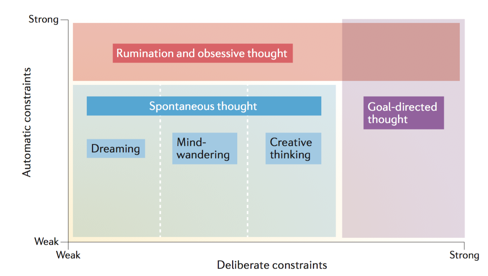

# Theoretical framework {#intro}

## Overt and imagined actions {#intro}

Blah blah [@koster_rumination_2013]...

Wittgenstein’s (1953) famous query: "When I raise my arm, what is left after subtracting the fact that my arm raised?". We posit that what is left is an internal model (a representation) of what should happen if and when my arm goes up (Jeannerod, 1999)...

### Motor imagery

Considerable experimental evidence has accumulated to suggest that movement execution and MI share substantial overlap of active brain regions (for review, see Guillot et al., 2012). Such apparent functional equivalence supports the hypothesis that MI draws on the similar neural networks that are used in actual perception and motor control (Jeannerod, 1994; Grezes and Decety, 2001; Holmes and Collins, 2001)...

See introduction of O’Shea (2017) phd thesis introduction...

See Stinear’s chapter in Guillot’s book for intracortical and spinal mechanisms involved during motor imagery (p.55-57).

#### Simulation theories

...

For Jeannerod (1995), motor imagery is necessarily first-perspective. Third perspective imagery is imagery, but not MOTOR imagery… Motor representations are conceived here as 'internal models' of the goal of an action. 

#### Emulation theories

...

#### Action representation and internal models

Voir Jeannerod (2004), Wolpert el al. (1995), Wolpert & Gharamani (2000)...

### Inner speech

...

The inner voice as the sensory consequence (prediction, see Loevenbruck et al., 2018) of imagined speech. Analogy with raising the arm: what we perceive when we imagine raising our arm are the sensory consequences (e.g., visual) of what would happen if we actually raised our arm, these are then kind of predictions. The same thing happens during inner speech production: the inner voice is the predicted auditory consequence of actual speech, except that it’s predicted. The two actions might seem very different, partly because of differences in the degree of automaticity. Imagining raising our arm might need a voluntary/deliberate/conscious (choose a word) intention (i.e., I want to raise my arm > I raise my arm) while speech imagery (i.e., inner speech) seems more automatic: we do not expression consciously the intention to speak, we just speak…

#### MVTV Cohen (1986)

...

#### Predictive models

Learning how to internalise speech might be similar to learning how to internalise playing an instrument... Let’s consider the analogy between speaking and playing an instrument (e.g., the piano). Playing piano results from the learning of an infinitely complex coordination of fine motor sequences, that in turn produce sensory (kinestheatic, auditory, visual, etc) feedback to the producer of the action (the agent). It seems that (from a certain level of analysis), the act of speech can be paralleled with the act of playing an instrument in that its consists in the coordination of infinitely complex movements that result in some modifications in the environment that in turn generate sensory feedbacks for the agent. Thus, pursuing the analogy, we argue that imagining playing pian and imagining speaking (i.e., producing inner speech) might rest on similar mechanisms… see O’Shea & Moran (2018) on expert pianists...

## Rumination as simulated speech

As suggested by @Christoff2016, rumination and other forms of spontaneous thoughts can be considered in a common conceptual space (see Figure 1). This space is built upon two dimensions: *deliberate constraints* and *automatic constraints*. These dimensions represent two general mechanisms that allow to constrain the contents of these related mental states and the transitions between them. The first contrain correspond to a deliberate processus and is implemented through **cognitive control** [@Miller2000]. The second constrain is referring to more automatic constrains like sensory afferences. In this framework, rumination is characterized by the highest level of automatic constraints and spread all along the *deliberate constraints* dimension.

```{r, echo = FALSE, fig.align = "center", fig.cap = "Conceptual space of different types of thought (Christoff et al., 2016)"}

```

...
