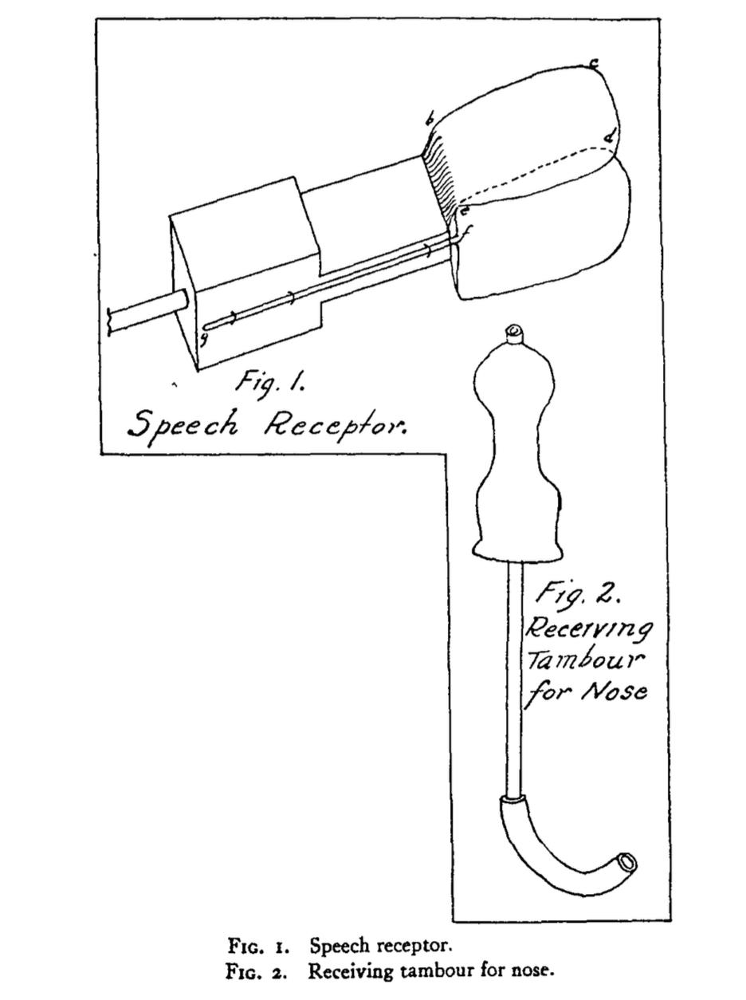
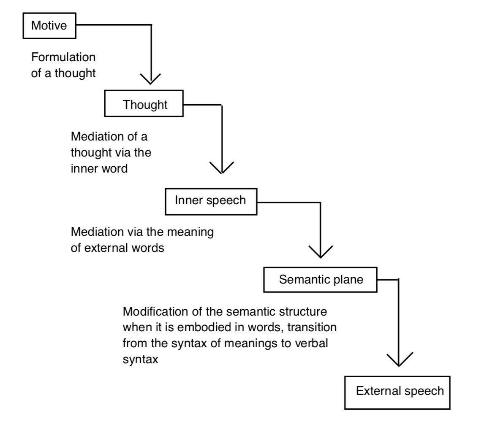
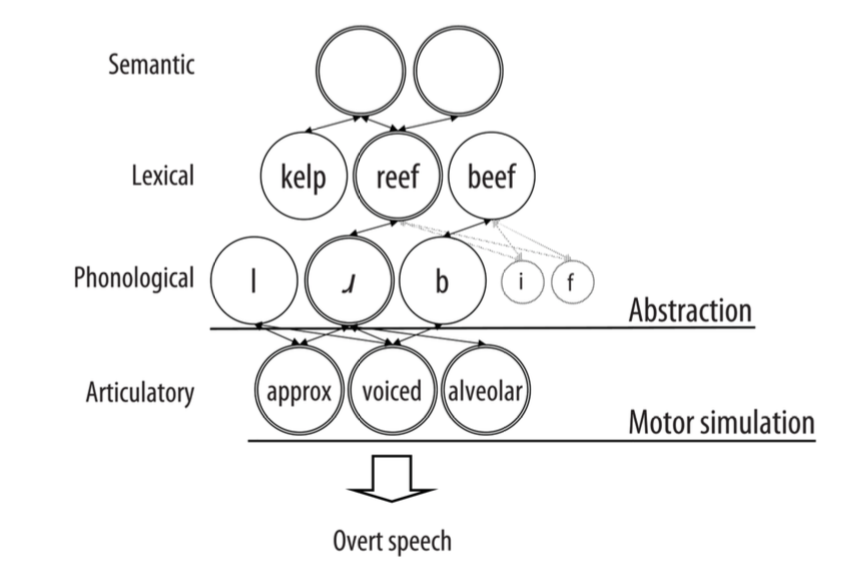
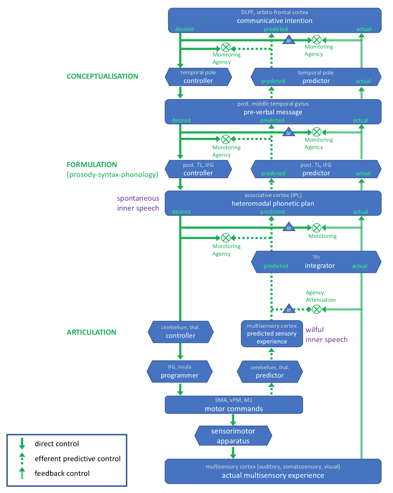

# (PART) Theoretical background {-}

\sloppy <!-- to avoid URLs going into right margin in the references section -->

# Theoretical framework {#intro}

```{r setupCH1, echo = FALSE, message = FALSE, warning = FALSE, results = "hide"}
knitr::opts_chunk$set(
  cache = TRUE, echo = FALSE, warning = FALSE, message = FALSE,
  out.width = "100%",
  # fig.pos = "H",
  fig.align = "center"
  )
```

\epigraph{"Inner speech is nothing but speech to oneself"}{Sokolov, A. N. (1972)}

\initial{A}s you read these words, you might notice the presence of an inner voice. This phenomenon, albeit occurring on a daily basis, usually remains unnoticed until we pay attention to it. However, if I ask you to focus on that little voice while reading these lines, you would probably be able to provide a relatively fine-grained description of this phenomenon. Whose voice is it? Is it yours? Is it gendered? It is usually possible to examine these aspects as well as lower-level features such as the tone, pitch, tempo, or virtually any sensory aspect of this voice. This first set of basic observations already provides us with some important insights. First, if we can think about our *inner speech*, then it should be something different from "thinking" itself (where thinking is used in its broadest sense to refer to any sort of mental episode). Rather, inner speech can be construed as *a* vehicle for conscious thought.^[We will not delve into the touchy question of the role inner speech plays in theories of consciousness [but see for instance @carruthers_language_1996;@dennett_consciousness_1991].] Second, the phenomenological observations we can make about our inner voice reveal that inner speech is (or can be) accompanied by sensory percepts (e.g., speech sounds, kinaesthetic feelings). It thus raises another set of fascinating questions about the origin and nature of inner speech percepts. Where do these percepts come from? Why do they look like the one we experience when we speak overtly?

This first set of questions refer to the *nature* of inner speech, that is, to *what* it is. In the present work, we are mostly concerned with these questions. Another set of issues revolve around the question of the *functions* of inner speech, that is, *what it is for*. The influential Vygotskian theory of inner speech development suggests that inner speech evolves from so-called *egocentric speech* (i.e., self-addressed overt speech or *private speech*) during childhood. As such, for the present purpose, we assume that the functions of inner speech are inherited from those of egocentric speech via a process of progressive internalisation. The specific features of this internalisation process are worthy of investigation on their own (and we briefly discuss them later on). However, we are mostly interested here in the *what is* (i.e., the nature) question. Thus, we will only sparsely address the question of the functions of inner speech.

That being said, a lot can be learned about inner speech by looking at situations in which these functions deviate from their original trajectory. These *dysfunctions*  are instances of inner speech where its (functional or adaptive) functions, such as problem-solving, self-regulation or planning do not work as intended. These dysfunctional instances of inner speech may include auditory verbal hallucinations [AVHs; for a detailed investigation of the relation between inner speech and AVHs, see @Rapin2011], where the sense of agency (i.e., who is the author of the internal speech) is impaired, or repetitive negative thinking such as worry or rumination, where the ability to control (or to disengage from) negative thoughts is impaired. In the present work, we investigate (some of) the psychophysiological correlates of rumination, starting with the theoretical assumption that rumination can be considered as a form of inner speech. Therefore, we study rumination as we would study inner speech, with the potential of refining our understanding of both rumination and inner speech.

Rumination is implicated in the development and maintenance of several psychiatric disorders such as depression or anxiety. For instance, rumination has been shown to be associated with the development, severity and maintenance of depressive episodes [e.g.,@treynor_rumination_2003;@Nolen-Hoeksema2000;@Nolen-Hoeksema2008]. Given the central role of rumination in depression and the societal importance of depression (both in terms of lifetime prevalence and associated costs), rumination has been considered a key target in modern cognitive and behavioural therapies [e.g.,@watkins_rumination-focused_2016]. However, although rumination has mainly been studied in the framework of depression and anxiety, it has been suggested to be a key process in many other disorders [e.g.,@Baeyens2012;@ehring_repetitive_2008;@Watkins2008]. Thus, rumination can generally be understood as a transdiagnostic process (i.e., a process that is not specific to a single disorder).

In this first chapter, we briefly review the main theoretical frameworks in which rumination has been studied. We then review the historical and contemporary conceptualisations of inner speech and suggest how rumination can be considered and studied as a form of inner speech. We then broaden the discussion by considering the analogy between inner speech and the more general phenomenon of motor imagery. Finally, we discuss how electromyography can be used (and has been used) to investigate covert actions (including inner speech), before moving to a brief introduction to the technical aspects of the present work (cf. Chapter \@ref(chap2)).

## Rumination: theories and measures

### Theoretical perspectives on rumination

It is intuitively straightforward to understand how the repeated mental rehearsing of negative content might impair cognitive functioning and worsen negative affects. Repetitively thinking about why you were unable to solve that sudoku during breakfast might lead to sustained negative affects throughout the day. However, research on rumination suggests that the process of thinking (i.e., how we think) about a certain content rather than the content of the thought (i.e., what we think about) is a more accurate predictor of the cognitive and affective consequences of repetitive negative thinking. Accordingly, rumination is described as a *repetitive* and *passive* thinking process that is focused on negative content. Whereas this definition is general enough to encompass several conceptualisations of rumination, it does not tell much about its functions or mechanisms. In this section, we review the most important theoretical models that have been proposed to explain the origin and the role of rumination in psychopathology. We do not aim to provide an exhaustive review of the existing theoretical perspectives on rumination. Instead, we refer the reader to more extensive work (e.g., reviews or books) when appropriate.

One of the most prolific model of rumination is the response styles theory [@nolen-hoeksema_responses_1991]. This theory was developed to explain the relation between rumination and depression, as well as to account for gender differences in the way individuals respond to negative affects. Indeed, it has been suggested that female participants would be more likely to ruminate in response to negative affects whereas male participants would be more likely to distract themselves. The tendency for female participants to ruminate more than male participants has been confirmed and quantified in a recent meta-analysis [@Johnson2013]. According to the response styles theory, rumination consists of repetitive and passively thinking about the possible causes and consequences of negative affects. Thus, rumination is conceptualised as a mode of response to negative affects. Importantly, rumination is defined as an unconstructive thinking process, that is, a mode of thinking that does not lead to active problem-solving. Rather, rumination is thought to lead to a fixation on the problems and the feelings evoked by these problems.

The response styles theory suggests that rumination exacerbates and prolongs distress (including depression) through four main mechanisms [as reviewed in @Nolen-Hoeksema2008]. First, rumination has been suggested to "enhance" the effects of negative mood on cognition. This mechanism has been confirmed in experimental settings where rumination is induced and compared to distraction [e.g., following the rumination induction procedure developed in @nolen-hoeksema_effects_1993]. In these experimental settings, rumination has been shown to be associated with a negativity bias (i.e., a tendency toward negative interpretations) and to increase the recall of negative autobiographical memories [e.g.,@lyubomirsky_effects_1995;@Lyubomirsky1998;@watkins_rumination_2001]. Second, rumination has been suggested to interfere with problem-solving abilities. This has been confirmed in both dysphoric^[In the context of depression, dysphoria is usually defined as a preclinical state of general dissatisfaction or discomfort. In the DSM-V, dysphoria (or dysphoric mood) is defined "a condition in which a person experiences intense feelings of depression, discontent, and in some cases indifference to the world around them."] participants [e.g.,@lyubomirsky_effects_1995] and clinically depressed participants [e.g.,@watkins_distinct_2005]. Third, rumination might also interfere with motivation and instrumental behaviour. More precisely, one study shown that whereas dysphoric ruminators recognise that some activities might be beneficial for their mood, they are unwilling to engage in them [@lyubomirsky_self-perpetuating_1993]. Finally, rumination has been suggested to erode social support. For instance, @nolen-hoeksema_thanks_1999 shown that although chronic ruminators were more likely to reach out for social support, they reported less emotional support from others. According to the response styles theory, rumination is therefore maladaptive in that it worsens negative affects. In the first formulation of this theory, the adaptive alternative to rumination was thought to be *distraction*, during which the focus of attention is directed away from distress (e.g., by engaging in distractive activities such as sport or group activities). However, the adaptive status of distraction is still a matter of debate [for review, see @Nolen-Hoeksema2008].

@trapnell_private_1999 later attempted to distinguish different forms of rumination based on their outcome. They suggested to make a distinction between rumination and intellectual self-reflection. Whereas the later construct is supposed to reflect a more adaptive component of the self-reflective process, empirical data on that question is not conclusive [@Nolen-Hoeksema2008]. @treynor_rumination_2003 have suggested, based on a reanalysis of the ruminative response scale (a rumination questionnaire discussed in the next section), that two components of rumination could be distinguished. More precisely, they obtained two factors coined as *brooding* and *reflective pondering*. Brooding refers to more negative aspects of self-reflection and a focus on abstract questions such as "Why do I always react the way I do?" and was positively correlated with depression. Pondering refers to a more general self-reflective process, which might be more related to problem-solving abilities. However, pondering has also been show to be positively correlated with depression concurrently [but to be negatively correlated to depression longitudinally, @treynor_rumination_2003].

In another line, self-regulation theories [@carver_self-regulation_1998;@Martin] suggest that rumination is triggered by perceived discrepancies between one's current state and a desired goal or state. For instance, if a researcher has the goal of publishing her research in a prestigious academic journal but has virulent discussions with reviewer #2, she is likely to focus on and to repetitively think about the discrepancy between her goal (publishing the paper) and her current state (having endless discussions with a critical peer). In that situation, the self-focused thinking might end either when the researcher acts in the direction of reducing the discrepancy between the situation and the goal (e.g., by complying with the reviewer's requests) or by giving up on her initial goal. In any case, self-focused thinking would therefore be instrumental, in the sense that it would help to resolve the discrepancy. However, the researcher might also continue to focus on the discrepancies between her desired state and the current state in a passive way. In that situation, the discrepancy might persist and she might experience negative affects. Thus, self-regulation theories suggest that rumination can be either adaptive or maladaptive. In brief, rumination is adaptive when it leads to (efficient) problem-solving but is maladaptive when it does not lead to (efficient) problem-solving.

Another attempt to distinguish different types of rumination according to their outcome has been developed by Edward Watkins and colleagues, building upon @teasdale_emotional_1999's work on emotional processing modes. The theory of processing mode [@watkins_adaptive_2004;@Watkins2008] makes a distinction between two types of rumination. The first type of rumination involves abstract and evaluative thoughts about oneself (e.g., thinking about the causes, meanings and consequences of). The second type of rumination involves non-evaluative and concrete thoughts about present experiences (e.g., focusing on the experience of). A number of studies have confirmed that different forms of rumination might be distinguished according to their adaptive or maladaptive outcomes [for a review, see @Watkins2008]. These results (amongst others) constitute the theoretical basis upon which rumination-focused therapies have been developed [e.g.,@watkins_psychological_2015;@watkins_rumination-focused_2016].

So far, we have defined rumination as either a trait, a stable and habitual mode of response (response styles theory), or as momentary thoughts that are triggered by goal-state discrepancies (self-regulation theories). In other words, the former explains how rumination can be considered as a stable mode of response whereas the later explains how rumination might start. However, there has been a few attempts to integrate these two views in a common framework. One promising integrative approach has been proposed in the form of the habit-goal framework of depressive rumination [@watkins_habit-goal_2014]. This framework is built on the idea that rumination could be explicitly considered as a *mental habit* [@hertel_memory_2004]. In classical conditioning and learning theories, a stimulus-response habit is formed when a response is repetitively associated with a stimulus (and when this association is reinforced). An important aspect of habits is their *automaticity* and the lack of awareness. Indeed, habitual responses are evoked "automatically" (i.e., without conscious effort) by contextual cues. Moreover, as habits are usually slow to learn, they are also slow to unlearn (i.e., they are relatively stable over time). The habit-goal framework considers rumination as a form of habitual response to goal-state discrepancies that occur frequently and repetitively in the same emotional context (i.e., depressed mood). Therefore, this framework permits to explain how rumination, while being originally triggered by state-goal discrepancies, might become independent of these goals through repetition. After learning, rumination might simply be "evoked" by contextual cues (e.g., negative mood). This would partially explain why rumination, as a habitual response, is particularly difficult to interrupt. This view of rumination also has implications for rumination-focused therapies [see discussion in @watkins_habit-goal_2014].

Another line of research is interested in the cognitive correlates of the deficits and biases associated with rumination [e.g.,@joormann_emotion_2010;@Koster2011]. One of the central feature of rumination is its perseverative nature [@mor_ruminative_2015]. As suggested by @christoff_mind-wandering_2016, rumination and other forms of thoughts can be considered in a common conceptual space (see Figure \@ref(fig:conceptual)). This space is built upon two dimensions: the *deliberate constraints* dimension and the *automatic constraints* one. These dimensions represent two general mechanisms that allow constraining the contents of mental states and the transitions between them. The first constrain correspond to a deliberate process and is implemented through *cognitive control* [@miller_prefontral_2000].^[Cognitive control refers to a set of mental processes allowing flexible adaptation of cognition and behaviour in accordance to one's current goals [@braver_variable_2012;@friedman_unity_2017]. We use the terms of cognitive control, executive control or executive functions in an interchangeable manner.] The second constrain is referring to more automatic processes like sensory afferences (e.g., visual or auditory saliency). In this framework, rumination is characterised by the highest level of automatic constraints and is spread all along the *deliberate constraints* dimension. In other words, rumination is characterised by a strong automaticity, which is is coherent with the mental habit view of rumination discussed in the previous section.

```{r conceptual, echo = FALSE, fig.align = "center", out.width = "75%", fig.cap = "Conceptual space of different types of thought according to deliberate and automatic constraints (Figure from Christoff et al., 2016)."}
knitr::include_graphics("assets/conceptual_space.pdf")
```

Accordingly, cognitive theories of rumination have tried to describe the cognitive mechanisms that are associated with rumination and its perseverative nature. These approaches try to answer questions such as: What are the cognitive underpinnings of the tendency to ruminate? What kind of cognitive biases does rumination cause? To answer these questions, the cognitive control processes that are the most often investigated in relation to depression (and rumination) are the ability of i) inhibiting irrelevant content or a prepotent answer, ii) shifting between tasks and iii) updating current working memory content [for reviews, see @mor_ruminative_2015;@grahek_cognitive_2018;@lemoult_depression_2019]. @linville_attention_1996 first suggested that deficits in attention inhibition may underlie rumination. This proposition was later confirmed and refined by Joorman and colleagues [e.g.,@joormann_emotion_2010;@joormann_cognitive_2007;@joormann_emotion_2014], who shown that rumination is associated with biases in multiple inhibitory processes. They shown that rumination is associated with inhibition deficits with mood-congruent (i.e., negative) material. More precisely, it is proposed that rumination is associated with a decreased ability to limit the access of irrelevant negative information (inhibition) and to discard negative irrelevant information (updating). @Koster2011 proposed that rumination would be the result of a combination of impaired conflict signalling and impaired attentional control. A conflict usually emerges when self-evaluative negative thinking is cued by internal or external stressors and conflicts with an individual's goals. According to this model, it is an impaired conflict signalling *and* an impaired ability to *disengage* attention from self-relevant negative information that explains prolonged ruminative thinking. This idea has been since corroborated by experimental work showing that difficulty disengaging attention was associated with rumination [e.g.,@grafton_stuck_2016;@southworth_heightened_2017] and by a recent meta-analysis [@zetsche_shedding_2018].

Another view on the relation between cognitive control and rumination has been developed by @Whitmer2013 and is known as the attentional scope model of rumination. In this framework, negative mood would "facilitate" rumination by narrowing the scope of attention. A narrowed scope of attention would limit the the number of available thoughts and reduce the ability to inhibit irrelevant information or to switch to other information. In contrast, a broader attentional scope (e.g., caused by positive mood) would increase the array of available thoughts. Although some studies indeed found a narrower attentional breadth following a rumination induction [e.g.,@grol_effects_2015], it is not clear whether attentional breadth is causally involved in ruminative thinking. For instance, @fang_can_2017 failed to obtain transfer effects following a visual attentional breadth training.

Overall, a large number of studies has demonstrated that cognitive control abilities are impaired in individuals with a strong propensity to ruminate (trait rumination) or following a rumination induction (state rumination). For instance, @Davis2000 showed that ruminators (in comparison with non-ruminators) committed more errors in the Wisconsin card sorting task, highlighting a lack of cognitive flexibility in ruminators. Another study using a mixed antisaccade task showed an impaired inhibition but intact switching abilities in ruminators [@DeLissnyder2011]. Using the Stroop task, @Philippot2008 observed that rumination was associated with impaired inhibition. Moreover, recent results suggest that training inhibition might reduce the negativity bias and state rumination [e.g.,@daches_training_2014;@daches_training_2019]. Experimental work also demonstrated that difficulties in shifting between different tasks was associated with higher levels of rumination (particularly brooding) in both depressed and nonclinical participants [for reviews, see @koster_cognitive_2017;@lemoult_depression_2019;@mor_ruminative_2015;@Whitmer2013].

Studies using cognitive bias modification also permit to experimentally manipulate information-processing biases to assess their effect on mood and behaviour. For instance, @siegle_neurobehavioral_2007 showed that participants who received six sessions of cognitive control training [the attention control training and the paced auditory serial attention task, @wells_emotional_2000;@gronwall_paced_1977] presented reduced levels of rumination after the training. @hoorelbeke_internet-delivered_2017 confirmed this finding by showing that an internet-delivered training of ten sessions lead to reduced levels of rumination and depressive symptoms after the training in remitted depressed patients [for a review of cognitive control interventions for depression, see @koster_cognitive_2017].

In brief and as summarised by @van_vugt_how_2018, the cognitive approaches of rumination can be said to be divided into three (non-exclusive) classes. These approaches consider rumination i) as arising from a bias toward negatively valenced information [e.g.,@Whitmer2013], ii) as arising from difficulties in discarding or disengaging from negative and self-relevant information [e.g.,@Koster2011;@joormann_emotion_2014], or iii) as a "habit of thoughts" defined by specific pattern of memory associations [e.g.,@cramer_major_2016]. Following the later conception, @van_vugt_how_2018 developed a computational model of rumination implementing the idea that rumination can be considered a maladaptive habit of thought. They showed how rumination can result from particular configurations of memory chunks and their associative structure. This model was able to predict the decline in cognitive task performance observed in depressed patients. Therefore, the computational approach in psychopathology and psychiatry might permit to implement the cognitive models described previously and to make testable predictions about cognitive tasks performance [see also @grahek_motivation_2019, for a mechanistic approach of motivation and cognitive control in depression].

<!--
At the neural level, depression is known to be associated with a hypoactivity in the cortical structures associated with attentional control and with a hyperactivity of the amygdala when confronted with a stressor... as reviewed in @Koster2011... Habitual thinking styles (such as rumination) might also be related to the default mode network (DMN). This set of regions has been shown... and includes cerebral regions such as the ... [@raichle2001]... it has been suggested that self-reflective thoughts might be associated (positively correlated) with the activity of the DMN...
-->

### Measures of rumination

In the following, we make a distinction between measures aiming to assess the stable tendency of individuals to engage in rumination (i.e., trait rumination) and measures aiming to assess the presence, quality or intensity of momentary rumination (i.e., state rumination). Likewise, we present and discuss several types of measures, from self-reported measures to physiological measures. For each type of measure, we first present and discuss measures of trait rumination before turning to measures of state rumination.

Rumination has traditionally been assessed through self-administered questionnaires. The most commonly used measure of trait rumination is the ruminative response scale (RRS) of the response style questionnaire [RSQ, @nolen-hoeksema_prospective_1991]. The RSQ is an operationalisation of rumination as it was conceptualised in the response styles theory [@nolen-hoeksema_responses_1991]. The RRS consists of 22 items describing responses to dysphoric mood that are self-focused, symptom-focused, and focused on the causes and consequences of one’s mood. A short version of the scale containing ten items has been shown to be highly related (r = .90) to the full version of the questionnaire [@nolen-hoeksema_mediators_2001]. However, it has been argued that the RRS might contain overlapping items between rumination and depression [@treynor_rumination_2003]. In response to these concerns, @treynor_rumination_2003 removed the ambiguous items from the original RRS and conducted a novel factor analysis. This analysis revealed two distinct components: brooding and reflective pondering (as discussed in the previous section).

Based on @Watkins2008' distinction between constructive (concrete experiential thinking) and unconstructive (abstract analytical thinking) forms of rumination described previously, @barnard_getting_2007 developed the Cambridge Exeter Repetitive Thought scale (CERTS) to assess different facets of rumination. This questionnaire contains 84 items arranged in three parts assessing i) the context of rumination, ii) the self-evaluation of the functionality of rumination and iii) ruminative processes. The short version of this questionnaire, the Mini-CERTS [@Douilliez2012], contains 16 items extracted from the third part of the CERTS. These items evaluate more specifically the two dimensions identified by @Watkins2008. Interestingly, the concrete dimension of the Mini-CERTS appears to be related to the brooding dimension of the RRS whereas no relation was found between the concrete dimension of the Mini-CERTS and other subscales from the RRS [@Douilliez2012].

Several questionnaires have also been developed to assess the tendency to ruminate (i.e., trait rumination) as a transdiagnostic process. This includes (amongst others) the rumination-reflection questionnaire [@trapnell_private_1999], the repetitive thinking questionnaire [@McEvoy2010] or the perseverative thinking questionnaire [@Ehring2011]. Several other measures have also been developed to assess more specific forms of repetitive thoughts or processes related to ruminative thoughts such as meta-cognitions, thought control or stress or sadness-reactive rumination [for a review of existing measures of rumination, see @luminet_assessment_2004].

Rumination can also be seen as a momentary response (state rumination). The effects of state rumination are usually assessed in laboratory settings where rumination is induced and compared to another (more adaptive) form of emotion regulation such as distraction or problem-solving [for review, see @lyubomirsky_thinking_2015]. Some measures have been developed to assess state rumination but usually in reaction to specific events (e.g., stress-reactive, offence-reactive or sadness-reactive rumination). Moreover, until recently, there was no comprehensive and validated measure of state rumination. Nevertheless, the increasing use of the experience sampling methodology [@csikszentmihalyi_validity_1987] to investigate rumination in a more naturalistic environment lead to the development of short scales that could be used quickly and repetitively throughout the day. For instance, @Moberly2008 operationnalised momentary ruminative thinking using two items. The first item asked participants to rate the extent to which they were focused on their symptoms, consistent with the conceptualisation of rumination of the response styles theory [@nolen-hoeksema_responses_1991]. The second item asked participants to rate the extent to which they were focused on their problems, consistent with self-regulation theories [@carver_self-regulation_1998;@Martin]. @Moberly2008 considered this two-item measure to reflect "ruminative self-focus", independently of current (negative) affects. These two items are rated on a scale from 0 (not at all) to 7 (very much), from which a mean score is then computed.^[The exact items are not specified in @Moberly2008. However, @Huffziger2012 used a similar methodology and report the items they used, which were "At the moment, I am thinking about my feelings" and "At the moment, I am thinking about my problems".]

Very recently, @marchetti_brief_2018 developed the brief state rumination inventory (BSRI) to provide a more comprehensive and validated measure of state rumination. They report two studies showing good reliability and validity of this scale in both its English and Dutch version. This questionnaire is composed of eight visual analogue scales (VAS) ranging from "completely disagree" (numerically recoded as 0) to "totally agree" (numerically recoded as 100). These items are then summed to provide an indicator of momentary rumination. The BSRI is (to the best of our knowledge) the first validated full-length scale assessing momentary rumination.

Overall, the validity of self-report measures is based on the hypothesis that individuals have a reliable access to their internal states. However, we know self-reports increase reconstruction biases [e.g.,@rubin_what_1986;@conway_autobiographical_1990]. Moreover, we know that individuals usually have a low level of awareness of the cognitive processes that underlie their behaviours [@nisbett_telling_1977]. To overcome these difficulties, some authors have attempted to quantify state rumination and trait rumination more objectively, by recording physiological or neuroanatomical correlates of rumination [for a review, see @papageorgiou_physiological_2003]. Peripheral physiological manifestations (e.g., pupil dilation, blood pressure, cardiac rhythm, cardiac variability) have been examined during induced rumination or in association with trait rumination. For instance, a consistent link between perseverative cognition and decreased HRV was also found in a meta-analysis conducted by @ottaviani_physiological_2016. They also observed a positive association between (both trait and state) perseverative cognition and increased heart rate, systolic blood pressure, diastolic blood pressure, and cortisol activity [see also @zoccola_assessing_2012, for a review of the relation between rumination and cortisol].

With regards to state rumination, @vickers_effects_2003 have observed an increased systolic blood pressure after rumination induction, suggesting the involvement of the autonomic nervous system in rumination. Moreover, galvanic skin response has shown to be increased after a rumination induction in highly anxious women [@sigmon_impact_2000]. According to @papageorgiou_physiological_2003, disrupted autonomic activity could provide a reliable physiological correlate of rumination. In this vein, @Key2008 have observed a diminution of the high-frequency component of heart rate variability (HF-HRV) after rumination induction in people with a low tendency to ruminate [see also @woody_brooding_2014]. Moreover, @zoccola_cardiovascular_2014 showed that the physiological consequences of rumination might depend on the level of construal (i.e., abstract vs. concrete). More precisely, they showed that an induction of abstract rumination lead to lower blood pressure in comparison an induction of concrete rumination. @woody_trait_2015 further showed that the type of ruminative thought (imagery vs. verbal thought) was also associated with distinct physiological outcomes. They observed that verbal ruminative thoughts lead to greater increases in heart rate than ruminative thoughts in a visual imagery modality. This effect was moderated by trait rumination and was only present in high ruminators.

In the present work, we used facial surface electromyography (in addition to self-reports) to investigate the muscular correlates of induced rumination. Before turning to a presentation of this experimental work however, we need to discuss why we think rumination can be considered a form of inner speech and how inner speech (and therefore, by inclusion, rumination) can be examined using surface electromyography.

### On the verbal and sensory properties of rumination

One of the most salient features of rumination is that it is mostly expressed in a verbal modality [@ehring_repetitive_2008;@goldwin_concreteness_2012;@goldwin_concreteness_2013;@mclaughlin_effects_2007]. In other words, while ruminating, we are mostly talking to ourselves silently. However, rumination can also be experienced as visual imagery [@goldwin_concreteness_2012;@newby_comparison_2012;@pearson_frequency_2008]. By "visual imagery" we refer to a process during which perceptual information is retrieved from long-term memory, resulting in the experience of "seeing with the mind's eye" [@ganis_brain_2004]. Some authors have suggested that because rumination is usually past-oriented, it should increase access to negative autobiographical memories [@Lyubomirsky1998]. Moreover, because autobiographical memories are often experienced as visual images, rumination should likewise include visual features [@pearson_frequency_2008]. Several studies have obtained results that are consistent with this claim. Among a sample of patients who were diagnosed as clinically depressed, a significant majority (94.7% and more than 70%) reported that rumination combined verbal and sensory elements, among which visual imagery [@newby_comparison_2012;@pearson_frequency_2008, respectively]. When unselected individuals were asked about the quality of their rumination directly while ruminating, 60.53% of them said they had been experiencing verbal thoughts and 35.92% mental visual images [@mclaughlin_effects_2007]. Another study comparing naturally occurring depressive and anxious thoughts in a non-clinical sample, found that depressive thoughts involved more images than anxious thoughts [@papageorgiou_process_1999]. In addition, a recent study demonstrated that a considerable number of people experience depressive cognition in a visual form [@lawrence_visual_2018]. Furthermore, this study showed that individuals with a visual depressive cognitive style reported a similar amount of rumination as individuals with a verbal style. Overall, the existing literature indicates that rumination can have visual features, despite being predominantly verbal.

<!--
from @Douilliez2012: "Already two decades ago, studying worry, a form of rumination typical of general anxiety, Borkovec has observed that this pathological ruminative mode mostly consists in verbal and abstract thinking and is poor in imagery (Borkovec & Inz, 1990; Stöber& Borkovec, 2002)."
-->

These observations about the quality of ruminative thoughts are consistent with those concerning worry [e.g.,@stober_worry_1998;@mclaughlin_effects_2007]. Indeed the cognitive avoidance theory [@davey_cognitive_2006] suggest that worry, as a primarily linguistic repetitive thought, can be considered an avoidance response whose goal is to restrain aversive images, thus reducing somatic activation and processing of emotions. Similarly, forming negative mental visual images has been shown to lead to a greater increase in anxiety in comparison to forming negative descriptive sentences [@holmes_mental_2005]. Taken together, these findings suggest that different modalities of rumination could have different effects on individuals. This idea is supported by studies showing the effectiveness of mental imagery in accessing and modifying emotion in therapy [for an overview, see @hackmann_reflecting_2004]. Overall, investigating the verbal and visual features of rumination could contribute to sharpen our understanding of the ruminative processes and lead to better-adapted therapeutic strategies.

Some of the few studies specifically manipulating verbal and visual rumination were carried out by Zoccola and colleagues [@zoccola_cardiovascular_2014;@woody_trait_2015]. The verbal or visual form of rumination (or *mentation type* as these authors refer to it) was induced by playing audio tapes that directed participants’ thoughts. Prompts were similar in both conditions, differing only in the verbal/visual instruction ("Recall the speech task using words, phrases, and sentences." vs. "Recall the speech task using pictures and images."). Participants were subsequently asked to estimate the proportion of verbal thoughts and mental visual images. Importantly, it should be noted that in none of the studies in which thinking modality was manipulated, did the participants solely use one type of thought. Even though participants in the imagery group of @zoccola_cardiovascular_2014 reported higher levels of mental images in comparison to the participants in the verbal group, the later group also reported a certain level of mental imagery. This is in line with studies showing that rumination includes both verbal and visual components [e.g.,@goldwin_concreteness_2012;@mclaughlin_effects_2007], implying that it is not exclusively experienced in one modality. These results are substantiated by a recent study which has shown that participants generate visual images both in cases where they were told to visualise or to verbally think, while they have strong verbal representations only when asked to verbally think [@amit_asymmetrical_2017]. @amit_asymmetrical_2017 concluded that there is a difference in volitional control of verbal and visual thinking and that people have better control over inner speech than visual thought.

<!--
Although not directly focused on rumination, the task developed by @holmes_causal_2008 is quite inspiring in designing a protocol for exploring rumination in different modalities. These authors aimed to compare verbal and imagery processing in terms of their differential effects on emotion. They noticed that previous procedures provided verbal descriptions of the events that needed to be processed verbally or visually. The authors argued that with such descriptions, the imagery condition has an additional processing mode in comparison to the. Their proposed solution was to combine pictorial and verbal cues and to ask participants to integrate them into either a sentence or an image.
-->

To sum up, although rumination might be expressed in different modalities, it is usually expressed in a verbal form. Therefore, we suggest that *verbal* rumination migh be considered as a form of inner speech. To understand what this assumption implies for the study of rumination, we now turn to a brief historical overview of inner speech research. This historical tour will allow us to introduce the experimental tools that have been used to investigate inner speech throughout history. We will then present the main theoretical perspectives on inner speech and discuss its analogies with the broader phenomenon of motor imagery. Finally, we will discuss how surface electromyography can be used to investigate rumination as a form of inner speech.

## What is that little voice inside my head?

To begin our investigation with a clear definition, when we use the term of "inner speech", we refer broadly to the activity of silently talking to oneself. Whereas the exact nature of inner speech is still the matter of lively debates, @gregory_inner_2017 lists some consensual properties of inner speech, namely, that i) inner speech takes place in the mind, ii) an instance of inner speech is a linguistic occurrence, iii) inner speech is episodic (it occurs at a given moment in time), iv) an episode of inner speech involves mental imagery (may it be auditory, visual, or kinaesthetic), v) inner speech can be used in the service of working memory, vi) inner speech does not *necessarily* (and often does not) take the form of complete grammatical sentences (cf. our later discussion of Vygotsky's theory of inner speech development), vii) we do not have the same level of control upon our inner speech than upon our overt speech (whereas it is easy to stop producing external speech, it can be quite arduous to override inner speech).

While we produce inner speech on a daily basis to conduct inner monologues or dialogues, to prepare or to remember conversations, this activity remains nevertheless arduous to investigate in a controlled environment. Like most psychological phenomena, the study of inner speech began with introspective observations [@morin_inner_2009]. At the end of the XIXth century and throughout the XXth century, experimental psychologists gave a new look at inner speech through novel (neuro)physiological methods (we review these findings later on). As a result of being both a multi-facetted phenomenon (inner speech can be expressed in many forms or *varieties*) and being studied from different perspectives (from philosophy to linguistics and neurosciences), the activity of inner speech has been given many other names, such as covert speech, subvocal speech, verbal thinking, implicit speech, internal monologue, internal dialogue, endophasy, speech imagery, auditory verbal imagery, silent talk or silent speech. This plethora of names might be explained by the variety of the activity in itself (inner speech can be expressed in several forms) but also by the relatively vague definition that is usually attached to it.

Indeed, as noted by @vygotsky_thought_2012, the term of inner speech has been used to describe somehow different phenomena. More precisely, @vygotsky_thought_2012 suggested that this term has initially been employed to refer to "verbal memory", citing for example the "silent recital of a peom known by heart" (p.238). In that vein, @cardaillac_etudes_1830 earlier said: "la parole intérieure n'est que le souvenir de la sensation que produit la parole extérieure" [as quoted in @egger_parole_1881, p.53].^[Which can be translated by "inner speech is only the memory of the sensation produced by external speech".] The early investigations of inner speech throughout the XIXth century indeed mostly revolved around the question of knowing how words were reproduced in memory (either as auditory, visual or motor images). Under that view, inner speech is thought to correspond to an "image" of actual (overt) speech and this position may be said to correspond to the *imagined speech view* described in @gregory_inner_2017.

<!--
This distinction might be paralleled with more contemporary notions such as the distinction between the inner voice and the inner ear or between inner speaking and inner hearing (we will come back to that later on)... difference between imagination and imagery (see Wilkinson & Fernyhough, 2017)...
-->

According to the second perspective listed by @vygotsky_thought_2012, inner speech could be conceived as truncated overt speech, that is, "speech minus sounds" or "subvocal speech" [@watson_psychology_1919]. For instance, in line with his reflexologist theory of thought, Sechenov considered inner speech to be an inhibited (motor) reflex and wrote: "I never think directly in words, but always instead in muscular sensation which accompany my thought in the form of a conversation" [cited in @sokolov_inner_1972, p.4]. It should be noted however, as highlighted by @sokolov_inner_1972, that the behaviourist approach and the reflex approach differ in that the former consider that inner speech "originate" from peripheral muscular activations, whereas the later consider inner speech to result from central (cerebral) processes. According to that latter perspective, the peripheral muscular activity recorded during imagined actions (or inner speech) would be a side-effect of these central processes.^[We will comme back to this important distinction in more details later under the disguise of the "centralism versus peripheralism" debate.] In that view, inner speech is considered as an occurrence of actual speech (as overt speech is) thought to correspond to an "image" of actual (overt) speech and this position may be said to correspond to the *actual speech view* described in @gregory_inner_2017.

According to @vygotsky_thought_2012, a third interpretation of inner speech would refer to everything that "precedes the motor act of speaking". In other words, inner speech would include speech "motives" (or intentions) and the preverbal message that precedes speech production. We will come back to that position briefly when mentioning psycholinguistic models of speech production [e.g.,@levelt_speaking_1989] as well as the motor simulation model of motor imagery [e.g.,@jeannerod_motor_2006]. However, for the purpose of the current section, we are mostly concerned with the first and second position, namely, the view of inner speech as either imagined or actual speech.

In trying to separate these two views, @gregory_inner_2017 first notes that, phenomenologically, producing inner speech feels like speaking (albeit covertly), and not like imagining speaking. Gregory then lists some further arguments in favour of the actual speech view: i) *the embedding argument*: we can imagine producing inner speech, but we cannot imagine *imagining* producing inner speech, therefore inner speech is actual speech (rather than imagined speech), ii) *the paralleled case argument*: inner speech stands in the same relation to speech in a pretend scenario as overt speech does, therefore, inner speech is also actual speech [for more details, see @gregory_inner_2017, p.40], iii) *the continuity argument*: inner speech sits on a continuum with various kinds of external (and therefore actual) speech, iv) *the precisification argument*: the imagined speech view leaves too much details unspecified (e.g., who is speaking ? In what context ?), which is not the case of the actual speech view.

While we will not directly assess the empirical arguments in favour of either the *imagined speech* or the *actual speech* view of inner speech, we wanted to give the reader a clear definition of what we mean by "inner speech" and to present the two main conceptions about the nature of inner speech. We think these two conceptions and the arguments that have been advanced in favour or against each view are worthy to keep in mind while reviewing the empirical evidence on the topic. In the next section, we will briefly review the historical development of ideas and methods used to describe inner speech, before turning to a description of the developmental mechanisms of inner speech and to contemporary neurocognitive models of inner speech production.

### Historical overview of inner speech investigations{#inner-speech-history}

#### From introspection to experimental psychology

The question of the relation and intertwinement of thought and language is one of the most enduring philosophical question. Most notable reflections can be traced back to Plato's *Theaetetus*, in which Plato defines thinking as "the conversation which the soul holds with itself in considering anything". For Plato, the definition of thinking is taken to correspond to "word[s] spoken in silence". @sokolov_inner_1972 notes that ancient thinkers, by noticing a relation between thoughts and words, and between words and breathing, used to think that thoughts and words originated in the lungs. For instance, Socrates, in Plato's *Phaedrus*, said that "his chest is full of thoughts" [as quoted in @sokolov_inner_1972, p.14]. In another context, by noting the progressive internalisation of external speech into inner speech during normal development, @egger_parole_1881 wonders whether the phylogeny (the evolution of the species) followed this same course of development. In support of that idea, @egger_parole_1881 reports the existence of an ancient Egyptian ideogram, representing a crouched man, with the right hand close to the mouth. @egger_parole_1881 explains that this ideogram was meant to represent undistinctly the ideas of eating, drinking, screaming, talking, meditating, knowing or judging, suggesting that thought was considered to be localised in the mouth (p.84).

Somehow consistently with that idea, @stricker_studien_1880 reported (based on his own introspections) that he was not able to mentally produce speech sounds without making movements with the articulators. He also reported not being able to produce two different speech sounds, or to produce speech sounds that were incongruent with movement of the articulators. To give a reproducible example of his intuition, @stricker_studien_1880 suggested the following experiment: open your mouth and try to pronounce a word including labials or dentals, such as "bubble" or "toddle". Ask yourself whether the image of the word (your inner speech) is clear or distinct? According to Stricker (and James), most people would find it very difficult to imagine cleary these words with the mouth being open. Instead, the image of the work is rather imprecise and sounds like we were trying to produce (overtly) the word while keeping the mouth open. This sensation was already nicely described and analysed by @bain_senses_1855:

> "When we recall the impression of a word or sentence, if we do not speak it out, we feel the twitter of the organs just about to come to that point. The articulating parts --the larynx, the tongue, the lips,-- are all sensibly excited; a suppressed articulation is in fact the material of our recollection, the intellectual manifestation, the idea of speech."

@james_principles_1890 then notes that Stricker, "Like most psychologists, however, [...] makes of his personal peculiarities a rule, and says that verbal thinking is normally and universally an exclusively motor representation." Indeed, @paulhan_langage_1886 replied to Stricker that he was able to produce overtly the vowel [a] while simultaneously being able to get and maintain the mental image of any other vowel. He also reported that he was able to imagine the sound of any vowel without motor actions or feelings (images). On a similar note, @egger_parole_1881 believed inner speech to exist independently of motor phenomena and to be based predominantly on auditory representations. He noticed that although inner speech may be accompanied by vivid auditory imagery, inner speech is also very different from overt (external) speech, with inner speech being usually shorter and less grammatically structured than overt speech (we will come back to that observation later when discussing the development of inner speech).

In an attempt to reconcile the view of @stricker_studien_1880 for whom inner speech was purely motor with the view of @paulhan_langage_1886 and @egger_parole_1881, @ballet_langage_1886 suggested [as @james_principles_1890], that these authors probably generalised to the population what they observed on themselves. Ballet then asserted that the predominance of motor over sensory representations (or the reverse) might be a question of individual differences. We might add that the relative predominance of motor or sensory representations during inner speech might also be due to individual differences in the phenomenological sensitivity to some specific representation (some might be very acute in discriminating similar auditory images while not being able to discriminate similar visual images) and to contextual differences.^[Indeed, as we will discuss further later, it is very much probable that the predominance of some sort of representation over other forms might be contingent on contextual demands. In other words, depending on the task to be realised, the motoric and sensory aspects of inner speech might be weighted differently.] Nonetheless, for many authors, this debate highlighted the limitations of the introspective method [e.g.,@reed_existence_1916]. To be able to decide between different individual experiences and interpretations, some researchers therefore tried to find more objective methods to assess inner speech, or as put by @reed_existence_1916, to go beyond introspection and to start looking for "the stamp of objective certainty". With this ambitious goal in mind, @reed_existence_1916 describes an apparatus he used to examine tongue movements (see Figure \@ref(fig:reed)). Reed then reports the results of an experiment aiming to examine the involvement of inner speech (and speech motor processes) in thinking.

```{r reed, out.width = "50%", fig.cap = "Figure 1 \\& 2 from Reed (1916) describing the apparatus used to record tongue movements during thinking and inner speech."}

```

@reed_existence_1916 observed that while reading, his participants were moving their tongue and lips (and were sometimes whispering). These observations, in addition to the behaviorist revolution in Psychology paved the way for new lines of research. The initial suggestion of @watson_psychology_1913 that "thought processes are really motor habits in the larynx" lead to a fruitful line of research about the muscular bases and/or correlates of thought and inner speech. @sokolov_inner_1972 gives an overview of the experiments carried out at the beginning of the XXth century in that perspective. For instance, @dodge_motorischen_1896 anesthetised his lips and tongue and realised that it did not have any impact on his inner speech. @curtis_automatic_1900 and @courten_involuntary_1902 recorded laryngeal movements using a pneumatic drum and a kymograph while their participants recited verses or were reading. They observed that laryngeal movements were not always present and depended on what was being read and/or produced, as well as on the "degree of understanding" of the participant [for further references, see @sokolov_inner_1972, p.43-45].

Using a galvanometer and electrodes inserted in the tip of the tongue, in the cheek, or under the lip, @jacobson_electrical_1931 recorded muscular action potential while participants were asked to produce verbal content covertly (e.g., counting or reciting a poem), but not during relaxation. Interestingly, @jacobson_electrical_1931 adds that "the series of vibrations during the mental activity occur in patterns evidently corresponding with those present during actual speech." More precisely, the pattern of muscular of activity recorded during inner speech production was similar to the pattern of muscular activity recorded during overt speech production, but of lesser amplitude.

Throughout the present section, we briefly reviewed the history of ideas and methods used to describe inner speech in the second part of the XIXth century and at the beginning of the XXth century. In the next section, we discuss the developmental trajectory of inner speech. How and when do we (humans) acquire the ability to talk to ourselves silently? Is it even acquired? To answer these questions, we will briefly review Vygotsky's theory of inner speech development and some of its more recent refinements. By examining how inner speech develops, we might gain new insights about the characteristics of inner speech in the adult mind.

#### The development of inner speech

The developmental course of inner speech was possibly the most investigated issue related to inner speech in the first part of the XXth century. Among many, Watson, Piaget, Luria, Leontiev, and most famously Vygotsky confronted this question. @watson_psychology_1919 suggested that thought was rooted in (overt) speech, with maturation leading from speech to thought (where thought is a synonym to inner speech, in Watson's terminology). This hypothesis also applied to reading, with the novice reader reading overtly and progressively shifting to silent reading. For Vygotsky, the study of inner speech in the mature (i.e., adult) brain could only be understood from a developmental perspective. In the last chapter of his book *Thought and Language*, Vygotsky analyses the relationship between thought and word in the mature mind. The central idea of this chapter is stated as follows:

> "The relationship between thought and language is not a thing, but a process, a continual movement back and forth from thought to word and from word to thought. Viewed in the light of a psychological analysis, this relation is a process that passes through a series of phases and stages, during which its essential features undergo changes that may be called development in the strict sense. Of course, this is a functional development, not development in the sense of aging; but the path traversed by thinking as a process from thought to word is development nonetheless."

<!--
@akhutina_role_2003 highlights a distinction between the study of inner speech (and speech production in general) in the west based on linguistics and chomsky work, and its origin in Marxist psychology in the east, where language is to be though in relation to its usages. The discussion of inner speech in soviet Psychology resolved mostly around the issue of the functions of inner speech. The work of Vygotsky and Blonsky (for instance) culminated in suggesting that inner speech is speech "to oneself" and "for oneself".
-->

Fundamentally, Vygostky believed that language was a psychological tool and that its development during childhood interacts with the development of abstract thinking. Vygotsky observed, as Piaget before him, that the child tends to speak (aloud) to himself while playing. Piaget characterised this form of speech as "egocentric speech" because in this form of speech, according to Piaget, the child does not try to take the perspective of the listener. Piaget thought this form of speech to disappear at the age of seven or eight. In contrast, Vygotsky thought that the so-called egocentric speech (or private speech) continues but that it becomes more and more internalised, until reaching the status of "inner" speech. For Vygostky, this internalisation process starts with social speech, that is speech addressed to others. During development, this form of speech evolves to either communicative speech (speech addressed to others) and so-called egocentric speech (speech addressed overtly to oneself). This form of speech appears naturally in children while being faced with a problem to solve, but also in adults faced with difficult problems. This egocentric speech would then became internalised, resulting in what we call inner speech. This lead Vygostky to claim a functional equivalence between egocentric speech and internal speech, the later resulting from a progressive internalisation of the former.

<!--
In other words, for Vygotsky, inner speech inherits the function of private (overt) speech, as it results from the progressive internalisation of private speech, and occurs in the same context and with the same goal (or function).
-->

However and importantly, this internalisation process does not *only* entail a movement from the outside to the inside but also entails a transformation of speech, or, as put by Vygotsky, an "internal reconstruction of an external operation". Therefore, for Vygostky, it follows that the passage from inner speech to overt speech consists not in simply "vocalising" inner speech but in *restructuring* inner speech (e.g., retrieving a syntax proper to overt speech, retrieving the phonetic structure, etc). According to @vygotsky_thought_2012, inner speech is described by some essential properties such as: i) *abbreviation*: the phonetic aspect is "diminished", reduced, "In inner speech we do not need to pronounce a word in its entirety. We understand, by virtue of our very intention, what word we wanted to say [...] Strictly speaking, inner speech is almost wordless", ii) *predicativeness*, "Psychologically, inner speech consists of predicates only"; "the subject of our inner reason is always present in our thought"; it is always implicitly understood, iii) it has a semantic structure of its own: predominance of *sense* over *meaning*^[Referring to Paulhan's distinction between the dictionary *meaning* of a word on one hand, and the individual *sense* of a word which is acquired by usage, on the other hand.], it is idiomatic, agglutination of semantic units (several words can be "merged" into a single word), and *infusion of sense* into a word (a word in inner speech becomes "loaded" with more associaitons thant in conventional use).

<!--
> Predication is the natural form of inner speech; psychologically it consists of predicates only. It is as much a law of inner speech to omit subjects as it is a law of written speech to contain both subjects and predicates. (Vygotsky, 1986, p. 243)
-->

Interestingly, Vygotsky rejected both the verbal memory view of inner speech (i.e., inner speech is simply the retrieval of acoustic, optic or motor images of words) and the behaviourist view of inner speech as merely a soundless form of external speech (à la Watson). For Vygotsy, the most determining factors of inner speech are its semantic (psychological) features, as expressed by his famous dictum: *Thought is not expressed in words; it comes into existence through them*.

<!--
```{r vygotsky, eval = FALSE, out.width = "75%", fig.cap = "Vygotsky’s levels in the process of verbal thinking. Figure from Akhtuina (2003)."}

```

For Luria (1956), a verbal utterance usually starts with a *motive*^[This includes desires and needs, interests and impulses, affects and emotions, etc.], that is something to express. For Luria, a verbal utterance always starts with a *vague thought* and the role of inner speech would be to transform this though into speech. Three stages i) the motive ii) the thought and its transformation to inner speech and iii) transofrmation to external speech... in his studies of aphasia, Luria (1947) then recognises thateach of these stages can be (more or less) independently impaired)...

*Copy-pasted from @akhutina_role_2003: The way was paved for this hypothesis by Soviet psychology and its notion of the multilevel structure of inner speech (Anan’ev, 1946, 1960; Sokolov, 1959, 1968). In Anan’ev’s view, one of the indisputable postulates of inner-speech theory is “that inner speech is a process that varies in terms of its readiness to be transformed into external speech.” For Anan’ev, inner speech has the following phases...*
-->

@fernyhough_alien_2004 recently proposed an extension of Vygotsky's three-level model of inner speech development (i.e., external speech, egocentric speech, inner speech) to a four-level model, from external dialogue to private speech, expanded inner speech and condensed inner speech (see Figure \@ref(fig:fernyhough)). @fernyhough_alien_2004 notes that this model describe stages in the development of inner speech (during childhood) but also movements "between the levels at any given point in time". Indeed, it is possible to "move" between levels under certain conditions. For instance, in cognitively demanding conditions, we can observe transitions between levels, with condensed inner speech being transformed to expanded inner speech and even dialogic private speech through a process of "re-expansion". This idea is supported by many studies showing an progressive externalisation of inner speech under cognitively demanding situations [e.g.,@sokolov_inner_1972].

```{r fernyhough, out.width = "75%", fig.cap = "Stages of internalisation. Figure from Fernyhough (2004)."}
knitr::include_graphics("assets/fernyhough_model_2004.pdf")
```

<!--
Based on this model, @fernyhough_alien_2004 formulated two propositions to explain the development of auditory verbal hallucinations (AVHs). First, AVHs might be caused by a disruption of the normal processed of internalisation during development... Second, AVHs would result from re-expanded inner speech under conditions of stress or cognitive challenge...
-->

To sum up, it is suggested that inner speech (in the adult mind) is the result of a progressive internalisation process. This internalisation process covers different stages or expressions of speech from social speech, self-addressed speech (private speech or egocentric speech) to inner speech (first in a very expanded form and then in a more condensed form). Being an internalised version of private speech, inner speech is hypothesised to be attached with the same functions as private speech. In other words, adults use inner speech with the same goals as they previously used (during childhood) overt private speech. Importantly, this internalisation process does not *only* entail an internalisation but also a transformation of the way speech is expressed: the characteristics of inner speech are distinguishable from the characteristics of overt (private) speech. Interestingly, these different levels (or stages) in the internalisation process, in addition to describing stages of development, also describe the "movements" that can be performed between levels or stages. More precisely, the externalisation of inner speech would entail the inverse transformation that has been applied during the internalisation of private speech. In the next section, we come back to our historical perspective by reviewing inner speech research that has been carried out in the second part of the XXth century, before turning to an overview of the main theoretical perspectives on inner speech production.

#### Inner speech research from 1950 to present days

Following the pioneering work of @jacobson_electrical_1931, the second part of the XXth century witnessed an upsurge of electrophyioslogical methods (and especially of electromyography^[See Chapter \@ref(chap2) for a brief introduction to (surface) electromyogaphy.]) to study the production of inner speech. Interestingly, the dominant interpretation of the muscular correlates of inner speech [as identified by @jacobson_electrical_1931] at the beginning of the last century was that the peripheral muscular activity observed during imagined actions was the *source* of the mental content. However, as explained by @jeannerod_motor_2006, this interpretation of mental processes as a consequence of peripheral feedback is now disproved, for instance by the simple fact that many people can experiment inner speech (or motor imagery) without any observable muscular activity. From there, one can ask whether the peripheral muscular activity observed during inner speech is *necessary* to the production of inner speech, or rather can be considered a consequence of inner speech production. As pinpointed by @cohen_motor_1986, to prove that a pattern of motor activity is *necessary* for some mental activity, it is not enough to show that this pattern is always associated with the mental activity, we also have to show that when the pattern of motor activity is disrupted, the mental activity is in turn disrupted. In that vein, the *peripheralist* interpretation of the motor correlates of inner speech (see Box \ref{centralism}) has been disproved by the heroic experiment carried out by @smith_lack_1947. Smith used d-tubocurarine (curare) to paralyse his own facial muscles in order to test whether peripheral muscular activation was necessary to inner speech. He reported that, while being paralysed, he was still able to think in words and to solve mathematical problems [these results echo thoese of @dodge_motorischen_1896, mentioned earlier].

Another way of looking at the motor correlates of inner speech production is to assume that these correlates are instead a consequence of central processes involved in inner speech production. As such, a disruption of these correlates do not necessary entail a disruption of the ongoing mental processes. Depending on the framework, these peripheral correlates might be considered as either necessary at the first stages of development of inner speech (as in behaviourist views of inner speech) or not necessary at all in other *centralist* perspectives such as the Russian reflexology or the more recent simulation or emulation frameworks. In these simulationnist frameworks, the peripheral muscular activity observed during inner speech production (or motor imagery) may be hypothesised to be the result of an incomplete inhibition of motor output during the mental states involving motor simulation (although the precise nature of these inhibitory mechanisms is still the matter of debates, cf. section \@ref(inner-speech-theories)).

\vspace{2mm}

\begin{mybox}[label = centralism]{Centralism versus peripheralism}

Many studies have shown that inner speech and, more generally, imagined actions, may be accompanied by peripheral muscular activation. However, the status of this muscular activity might be interpreted in several ways. According to the \textit{peripheralist view}, the mental image of an object would arise from muscular discharges in the related muscles (cf. work from James, 1890; Jacobson, 1931). In other words, for the tenants of this view, the peripheral muscular activity is a \textit{necessary} condition for the generation of the corresponding mental image.\\

According to the \textit{centralist view}, the existence of a muscle discharge during a mental state does not imply a bottom-up influence of these discharges on the mental state. The key idea is that the activation of peripheral mechanisms is not needed to generate the image (but they can be activated, as a consequence of the activation of the image/representation). This view is the view generally endorsed by Russian reflexology, by motor control models of inner speech production and by simulation or emulation models of motor imagery (cf. our later section on motor imagery).

\end{mybox}

Another fruitful line of research consisted in using *mental chronometry* (i.e., the timing of mental operations) to examine the cognitive processes underlying inner speech production. The logic underlying this paradigm is that if inner speech and overt speech production involve the same (or the same kind of) cognitive processes, then its production should take approximately the same time. By varying the conditions in which inner (or overt) speech is to be produced and by noticing the temporal equivalence (or non-equivalence) between inner and overt speech, we can infer whether the underlying cognitive processes are (dis)similar and how they are impacted by contextual demands. In that vein, @landauer_rate_1962 shown (using a single subject) that it takes approximately the same amount of time to say the alphabet (or series of numbers) aloud as it takes to produce it innerly. Similarly, @weber_visual_1969 and @weber_time_1970 shown that the rate of inner speech and overt speech is approximately the same (around 6 to 6.5 letters per second in these experiments). However, other researchers have observed opposite findings with inner speech being faster to produce than overt speech [e.g.,@anderson_speech_1982;@coltheart_phonological_1999;@korba_rate_1990;@mackay_problem_1981]. More recently, @netsell_rate_2016 have examined the rate of spontaneous speech production in both overt and covert modes. They asked participants to produce the first thing that came to their mind and observed that the rate of inner speech (around 5.8 syllables / second) was faster than the rate of overt speech (around 5.2 syllables / second). They suggest that this difference may be due to the time taken to effectively move the articulators during overt speech production (whereas these movements are inhibited during inner speech production). However, they also highlight that the rate of inner speech and the temporal equivalence between inner speech and overt speech may be affected by i) the type of speaking task (i.e., whether the task consists in reciting some learned verbal material or novel material) and ii) the form of inner speech (e.g., condensed vs. expanded inner speech). More precisely, they suggest that the rate of inner speech should be faster for learned material than for novel material and that condensed inner speech should be faster than expanded inner speech. 

@mackay_constraints_1992 notes that the faster rate that is usually observed for inner speech in comparison to overt speech reminds of the faster rates also occur for other highly trained skills (e.g., tying a shoelace). Indeed, the fact that inner speech is usually faster than overt speech (or that some forms of inner speech are faster than overt speech) and the fact that the chronometric similarity between inner speech and overt speech may be affected by the task echo findings from the field of motor imagery studies. In their review of the determinants of the temporal equivalence (or non-equivalence) between overt and covert actions, @guillot_understanding_2012 have clearly identified that this temporal equivalence may be affected by the type of action and the form of imagery. For instance, they suggest that there exists a sigmoidal relation between the duration of the overt action and the duration of the covert action, with short actions (less than a few seconds) being usually overestimated, medium action showing an isochrony in overt and covert modes and longer actions (more than 30 seconds) being usually underestimated in motor imagery (cf. Figure \@ref(fig:chronometry)). In addition to the duration of the movement, @guillot_understanding_2012 suggest that environmental constraints (e.g., temporal constraints, circadian rhythms), the motor imagery content (e.g., imagery type, imagery perspective), the individual strategy (e.g., where the focus of attention is), the individual characteristics (e.g., expertise level, age) and the motor skills characteristics (e.g., task duration, task difficulty) may also affect the duration of covert actions and the temporal congruence between overt and covert actions. Accordingly, the rate of inner speech (and its temporal correspondence to overt speech) might depend, as suggested by @netsell_rate_2016, on the type of inner speech to produce, on the length of the material to be produced and on individual characteristics (e.g., age, expertise), amongst other things.

```{r chronometry, out.width = "75%", fig.cap = "Relationship between the actual duration of a movement and its mental representation. Figure from Guillot et al. (2012)."}
knitr::include_graphics("assets/guillot_2012.pdf")
```

In addition to mental chronometry, many authors in the second part of the XXth century turned to psychophysiological methods to investigate inner speech. The idea that the production of inner speech may involve the speech motor system is supported by many studies showing peripheral muscular activation during inner speech production [as reviewed for instance in @garrity_electromyography_1977;@locke_subvocal_1970-1;@sokolov_inner_1972]. Among these, @faaborg-andersen_electromyography_1958 and @mcguigan_effects_1968 found an increase in peripheral muscular activity in the speech muscles during silent reading. Interestingly, this activity was more strongly marked for novice readers or for difficult material. @locke_subvocal_1970 compared the electromyographic correlates of subvocal speech (inner speech) during the (visual) presentation and rehearsal of disyllabic words that either contain or do not contain labial phonemes. They observed a greater EMG amplitude recorded over a "chin-lip" site during the presentation and rehearsal of labial words than for non-labial words.

In his seminal book, @sokolov_inner_1972 meticulously describes a series of experiments conducted in order to examine the relation between inner speech and thought. @sokolov_inner_1972 starts with a review of previous theories about the relation between speech and thought, before turning to the specific question of inner speech. He then presents his experimental work under two main parts. First, @sokolov_inner_1972 used articulatory suppression^[The expression *articulatory suppression* usually refers to a task which requires participants to utter speech sounds (or to produce speech gestures without sound), so that this activity disrupts ongoing speech production processes.] to interference with mental activity (e.g., perception, memorisation, thinking). Second, he used electromyography to investigate the involvement of the speech motor system during inner speech as well as in verbal and concrete thinking.

Summarising the studies using articulatory suppression, @sokolov_inner_1972 notes that "mechanical retardation of external articulation (speech movements of lips and tongue) has an insignificant effect on the performance of mental tasks by adults; in many cases it has no effect at all. In children, the mechanical retardation of articulation has a noticeable negative effect" (p.152). This result is coherent with the idea of a progressive internalisation of inner speech, that would become more and more independent from the speech motor system throughout development (and thus less affected by motor constraints). However, Sokolov notes that articulated speech and verbal-auditory stimuli have a strong effect on memory (p.152). Moreover, Sokolov discusses some of his previous experimental work showing that motor interference (e.g., articulatory suppression) ceases to be efficient when the mental activity (inner speech) is automatised (e.g., rehearsing a poem learned by heart). In addition to age and expertise, Sokolov discusses findings from Teplov, who observed that the involvement of the speech motor system during inner speech might vary according to the "voluntariness" of the speech to be produced. According to Teplov, the speech motor system would be necessarily involved during voluntary inner singing (a musical form of inner speech) whereas it may or may not be involved during involuntary inner singing [@sokolov_inner_1972, p.51].

Using electromyography, @sokolov_inner_1972 also provided seminal observations that inner speech is involved during reading, to an extent that is directly related to the difficulty of the ongoing reading task [as observed previously by @faaborg-andersen_electromyography_1958]. More precisely, he observed that the more difficult the task was, the stronger the "speech motor impulses" (i.e., the EMG amplitude) in the speech muscles. Moreover, the difficulty of the task was also related to the abbreviatedness of inner speech. Simpler reading tasks were associated with abbreviated (condensed)^[@sokolov_inner_1972 uses the term of "curtailment" for abbreviation (p.203).] inner speech whereas difficult tasks were associates with "unfolded" (expanded) inner speech, and sometimes externalised (overt) speech. Sokolov later says (on p.202):

> "[...] thus, it is evident that both the degree to which mental operations are automatized and the degree of complexity of the operations being performed can be assessed with a high degree of probability [confidence] on the basis of the intensity of hidden motor speech reactions."

Moreover, Sokolov observes that the muscular activity associated with inner speech production decreases when the verbal material is repeated many times (p.200-201). It increases again when new content is to be produced. For instance, he observes an important muscular activity during the reading of a new text, whereas this activity decreases when reading the text again. Interestingly, this reduction of peripheral muscular activity as a function of repetition may be countered by the instruction given to the participant. For instance, when the participant is given the instruction to "read it more attentively" or to "memorize it more accurately", the reading of a known text results in similar peripheral muscular activity (in the speech muscles) as for the reading of a novel text (read without such instructions).

To summarise previous (i.e., anterior to Sokolov) research, articulatory suppression and electromyographic investigations conducted by @sokolov_inner_1972, the involvement of the speech motor system during inner speech may vary according to the content of the verbal material, to characteristics of the task as well as to individual characteristics. More precisely, the intensity of "motor speech impulses" (in Sokolov's terms) may be intensified or reduced depending on i) the difficulty and novelty of the mental tasks being performed, ii) the degree of automatisation, iii) the inclusions of visual elements (whether the task is purely verbal or not), iv) individual disposition toward specific types of imagery. We can also add to these factors the age of the participant, with an involvement of the speech motor system being a decreasing function of age. Overall, these findings are coherent with the idea of a progressive internalisation of speech into inner speech, which lead Sokolov to state that "inner speech is nothing but speech to oneself" and that it can be considered as an internalisation, a psychological transformation or an "internal projection" of overt speech [@sokolov_inner_1972]. Sokolov concludes his work by stating that inner speech is "the principal mechanism of thought" and "an essential factor to human consciousness" [@sokolov_inner_1972, p.262].

Following seminal work by @jacobson_electrical_1931 and @sokolov_inner_1972, the 70s and 80s witnessed an upsurge of electromyographic studies of inner speech production. For instance, @mcguigan_discriminative_1974 recorded both lip and tongue EMG activity during the reading, viewing, memorising or recalling of either bilabial or lingual-alveaolar verbal material. They observed a double dissociation with the bilabial material being associated with a greater EMG amplitude recorded over the lip and the lingual-alveolar being associated being associated with a greater EMG amplitude recorded over the tongue (whereas EMG amplitude recorded over the arm or the leg did not show these condition-specific changes). Similarly, @garrity_measurement_1975 observed a greater lip activity during the covert production of labial items than during the covert production of nonlabial ites. Importantly, in her review, @garrity_electromyography_1977 highlights some methodological limitations to EMG studies of inner speech and makes practical recommendations to avoid these pitfalls (see Box \ref{garrity}). @mcguigan_patterns_1989 recorded EMG activity over the lip and the tongue during the processing of single phonemes ("P" vs. "T") and observed a greater activity of the lip during the processing of "P" and a greater amplitude of the tongue during the processing of "T", confirming previous results suggesting a discriminative relationship between the content of inner speech and its peripheral muscular correlates. In the same vein, @livesay_covert_1996 recorded EMG over the lip during the production of inner speech and during the visualisation of non-linguistic material and observed a greater EMG amplitude recorded over the lip during the production of inner speech. Interestingly, discussing the EMG correlates of inner speech (and motor imagery), @mackay_constraints_1992 remarks that this "EMG activity invariably precedes by a few milliseconds the full blown muscle activity that occurs during normal movements" (p.133). Taken together, these results suggest that the peripheral muscular correlates of inner speech are content-specific and that it should be possible to use electromyographic measurements to identify or "decode" the content of inner speech. This idea has been corroborated by recent work showing that surface EMG can be used to discriminate between different digits produced innerly, and that it could be used as a silent communication device [e.g.,@kapur_alterego_2018]. However, other teams find contrasting results [e.g., our results in Chapter \@ref(chap5) or @meltzner_speech_2008] and we discuss this issue further in Chapter \@ref(chap5).

\vspace{2mm}

\begin{mybox}[label = garrity]{Proper control conditions in EMG studies of inner speech production}

Many of the studies that used EMG to investigate the motor correlates of inner speech production concluded on the involvement of the speech motor system based on a difference in EMG amplitude when contrasting a period of inner speech production with a period of rest. However, as highlighted by Garrity (1977), it is usually not enough to show an increase of speech muscle activity during inner speech to conclude that this activation is related to inner speech production.\\

Three sorts of inference can be made through electromyographic studies of inner speech production, depending on the stringency of the control procedure. The stronger sort of inference is permitted by highlighting a discriminative pattern during covert speech production, as for instance when demonstrating a dissociation between different speech muscles during the production of speech sounds of different phonemic class (e.g, contrasting labial versus non-labial words). Other (weaker) types of control procedures include i) comparing the EMG activity during covert speech production to a baseline period (without contrasting phonemic classes in covert speech utterances), or ii) comparing the activity of speech-related and non-speech related (e.g., forearm) muscle activity. Ideally, these controls can be combined by recording and contrasting speech and non-speech related muscles in different conditions (e.g., rest, covert speech, overt speech) of pronunciation of different speech sounds classes (e.g., labial versus non-labial).

\end{mybox}

<!--

@sokolov_inner_1972 used only 10 ppts for the articulatory suppression studies (around page 100)... Inner speech in aphasia, see Luria (1950, 1963, see réfs in Sokolov p. 269)...

See Max (1935) or Novikova (1961) for EMG study of inner signing...

-->

Besides mental chronometry and electromyography, the second part of the last century also witnessed a revival of introspective methods with the aim of refining the description of the phenomenological properties of inner speech. For instance, the use of the experience sampling methodology  [ESM,@csikszentmihalyi_validity_1987] permitted to examine inner speech in a naturalistic environment and to assess its frequency, forms and usages. For instance, @klinger_dimensions_1987 asked 29 students to carry a beeper that probed them randomly to described the properties of their mental activity. They observed that around 51% of the samples contained some form of internal monologue. Using a modified version of the ESM known as the *descriptive experience sampling* methodology [DES,@Hurlburt2011;@Hurlburt2013;@hurlburt_descriptive_2006;@Hurlburt2001]^[The DES differs from the classical random-beeping strategy in that the participant, in addition to being probed several times a day (e.g., until 8-10 times a day), also has to meet with the experimenter at the end of the study. During this "expositional interview", the experimenter and the participant work together to clarify the meaning of these reported inner experiences as well as to contextualise them.], @heavey_phenomena_2008 assessed the frequency of common inner experiences and found that inner speech fills around 25% of our conscious inner life. Their results suggest that the rest of our inner experience is filled with four other main components: inner seeing, feeling (i.e., affective experiences such as happiness or sadness), sensory awareness (i.e., paying attention to immediate sensations such as hunger), and unsymbolised thinking (i.e., thinking without words, images, or any other symbol). Thus, our inner life is not only filled with language but other forms of thinking (defined broadly, as before, as any sort of mental activity) may coexist [for a review and synthesis of DES findings, see @Hurlburt2011;@Hurlburt2013].

Moreover, based on historical and DES data, @Hurlburt2011 argues for a distinction between two forms of inner speech (or two phenomenological aspects of inner speech). According to Hurlburt, it is possible to make a distinction between the phenomenon of *inner speaking* and the phenomenon *inner hearing*, whose feelings would be similar to talking in a tape recorder and to hear your voice played back, respectively [@Hurlburt2013]. @hurlburt_exploring_2016 provide data suggesting that these two phenomena may have distinct neural correlates [but see @loevenbruck_cognitive_2018, for another stance on these data]. The distinction between inner speaking and inner hearing echoes previous distinctions [e.g.,@mackay_constraints_1992] such as the one between the "generative component" (i.e., the feeling of producing speech) and the "auditory component" (i.e., the feeling of hearing speech) and the distinction between the *inner ear* and the *inner voice* in studies of working memory [e.g.,@baddeley_exploring_1984;@buchsbaum_role_2013].

<!--
See morin & uttl for a list of inner speech methods of investigation... recording of private speech of children in naturalistic environments (e.g., in the classroom) or in the laboratory. Moreover, think out loud methods have been devleoped, where participants are asked to (overtly) produce their though while being engaged in some task. A problem of this method is related to the re-expansion [@fernyhough_alien_2004]... we discuss this issue further later... Thought listing... thought sampling... notebooks...
-->

Another source of information concerning the nature of inner speech comes from the study of errors produced during inner speech. For instance, @dell_errors_1992 asked participants to produce tongue twisters (such as "Unique New York") either aloud or mentally and to report the type of error they made (if any). They observed that the participants made the same kind of errors in overt and inner speech, indicating that inner speech, like overt speech, may involve the same kind of units (e.g., phonological, morphological or lexical units). As suggested by @oppenheim_inner_2008, the similarity of errors found in inner speech and overt speech indicates that slips of the tongues are not really slip of the tongue, but rather slips of speech planning. More recently, @oppenheim_inner_2008 shown that the covert recitation of tongue twisters is accompanied by the lexical bias also observed in overt production but do not show the phonemic similarity bias (i.e., the tendency to exchange phonemes with common articulatory features) observed in overt speech. This observation lead @oppenheim_inner_2008 and @oppenheim_motor_2010 to claim that although inner speech is specified at a lexical level, it is impoverished at the featural (articulatory) level. In contrast to these results, however, @corley_error_2011 found the phonemic similarity effect to be present in inner speech, suggesting that inner speech is not necessarily impoverished at the articulatory level.

Another important indirect source of information with regard to the nature of inner speech comes from studies interfering with inner speech in order to make causal claims about inner speech. These studies include for instance articulatory suppression at the behavioural level and transcranial magnetic stimulation (TMS) studies at the neural level... Articulatory suppression, Reisberg, VTE...

Many studies investigated the cerebral correlates of both overt speech and inner speech and showed that both modes of speech production involve language areas in the left hemisphere, such as motor and premotor cortices in the frontal lobe, including Broca's areas or the left inferior frontal gyrus (IFG). These studies also highlight the involvement of regions involved in speech perception such as auditory areas, Wernicke's areas and the left parietal lobule, an associative region [for review, see @geva_inner_2018;@loevenbruck_cognitive_2018;@Perrone-Bertolotti2014]...

@ackermann_contribution_2004 observed an activation of the left supplementary motor area (SMA), left primary motor cortex (M1), and right cerebellum during covert speech... speech arrests... Fried et al., (1999) induced speech arrests on the left and right SMA (and in a lot of places, sometimes associate with involuntary movement of various articulators)... cf. the cerebral landscape of (wilfull) inner speech production in the next section...

More recently, the advancing of neuroimaging and intracortical recordings methods from the filed of neural engineering paved the way for new ways of investigating inner speech... Several teams are now conducting research with the aim of "decoding inner speech", that is, decyphering the content of inner speec based on neurophysiological signals. For instance... studies using electrocorticographic (ECoG, also known as intracranial electroencephalography or iEEG) recordings... @martin_decoding_2014... @martin_word_2016... [for a review, see @martin_decoding_2018]. Using surface electromyography and appropriate signal processing algorithms, @kapur_alterego_2018 developed a wearable device capable of discriminating inner speech content. They showed that their methods was able to discriminate with relatively high accuracy what digits (between 0 and 9) the user was producing covertly...

\begin{landscape}

```{r timeline, out.width = "100%", fig.cap = "Non-exhaustive overview of inner speech research from 1850 to present days."}
knitr::include_graphics("assets/timeline.pdf")
```

\end{landscape}

In this section, we briefly reviewed the history of inner speech research carried out over the last 170 years (from 1850 to present days) to give an overview of the evolution of ideas and methods related to inner speech research (these investigations are summarised in a non-exhaustive timeline presented in Figure \@ref(fig:timeline)). The interested reader will find supplementary information in more comprehensive reviews, theses, and books [e.g.,@alderson-day_inner_2015;@gregory_inner_2017;@fernyhough_voices_2016;@langland-hassan_inner_2018;@loevenbruck_cognitive_2018;@loevenbruck_loquor_2019;@Perrone-Bertolotti2014;@Rapin2011;@smadja_parole_2019]. In the next section, we discuss the most recent and important theoretical positions about the nature and production of inner speech.

### Theoretical perspectives on inner speech {#inner-speech-theories}

#### The psycholinguistics perspective

How do we (humans) produce speech? At a biomechanical level, producing speech means coordinating a complex dynamic system (i.e., the ensemble of speech muscles and organs) to produce slight perturbations of the air flow (sound waves). At a psychological level, speech production can be said to consist in the translation of thoughts into speech, with the goal of communicating information. Before being communicated however, the information of interest is submitted to several important transformations.

Although speech production is an everyday phenomenon, the way this process is exactly performed is still the subject of lively debates. However, current models generally agree with the core steps occurring during speech production. Willem Levelt [@levelt_speaking_1989;@brown_producing_2000] proposed an influential psycholinguistic model of speech production (see Figure \@ref(fig:levelt)). According to this model, speech production can be described at three levels: *conceptualisation*, *formulation* and *articulation*. The first step is managed by a component called the *conceptualizer*, and consists in selecting a conceptual message to be produced (*message generation*). In other words, the speaker conceives a comunicative intention that she wishes to reveal to an interlocutor. This *preverbal message* is then forwarded to another component, the *formulator*, that handles both *grammatical encoding* (i.e., selecting the appropriate word or *lemma*) and *phonological encoding* (i.e., selecting the appropriate speech sounds). During *grammatical encoding*, *lemmas* are retrieved from the *lexicon* and are ordered in a syntactical appropriate way, giving the message its *surface structure*. During *phonological encoding*, the message is given its phonetic or articulatory characteristics. At this stage, phonemes are grouped into pronounceable syllables. Then, each syllable is associated with an *articulatory program*, composed of an ensemble of *articulatory gestures* (i.e., coordinative structures of movements). These articulatory programs are stored in the *syllabary*. In brief, the *formulator* component transforms a *preverbal message* into a linguistic object. Finally, the phonetic plan is forwarded to the *articulator*, responsible for the activation of *articulatory gestures*, to be executed by the speech *articulators* (e.g., tongue, lips, jaw).^[This model permits to explain how a communicative intention is transformed into speech acts. However, it does not explicitly account for how speech acts are executed by the articulators. In the next Chapter, we briefly introduce some of the cores principles related to the biomechanics of speech production.]

```{r levelt, out.width = "75%", fig.cap = "Illustration of Levelt's (1989, 2000) model of speech production."}
knitr::include_graphics("assets/levelt.pdf")
```

<!-- about levelt model of speech production

However, it does not explicity account for how speech is *regulated* or *monitored* during its production. Speech production theories, in addition to being able to describe how speech is produced, its timecourse and caracteristics, should also be able to explain when and how speech production goes wrong, that is, when and how *speech errros* occur. These theories should also be able to explain how errors can be corrected and how speech, more generally, can be regulated. Several hypotheses have been emitted, that can be grouped under three main classes. Speech might be all programmed in advance, or there would be some *feedback control* during speech, or there would be a combination of both programmation and feedback control...

While grasping the concept of a visual image appears as relatively straightforward, it seems more difficult at first to grasp the concept of a motor image, especially when it comes to verbal imagery. The subjective experience of the tension that results from a given position of the articulators and the covert production of an incompatible speech sound permits to substantiate what a motor image is. For instance, it is generally impossible to generate the image of the pronunciation of the sound "b" while keeping the mouth wide opened [e.g.,@binet_psychologie_1886;@stricker_studien_1880]. This simple experiment allows defining imagined speech as the simulation of the corresponding overt verbal content, where *simulation* is meant to be understood either as the off-line rehearsal of neural motor networks involved in the overt action [@jeannerod_motor_2006], or in the terms of the emulation theories discussed previously^[Translated to speech, the MST is similar to previous proposals such as the *motor theory of voluntary thinking* [@cohen_motor_1986] or the hierarchical model of mental practice [@mackay_problem_1981].].

@gregory_inner_2017 adresses three important questions about inner speech, namely i) the question of what it is (e.g., an actual occurrence of speech or imagined speech), ii) the purpotedly dialogical property of inner speech, iii) whether inner speech can be a source of knowledge about oneself's beliefs and iv) the relation between inner speech and AVHs... Inner speech as actual speech or imagined speech ? see @gregory_inner_2017 and @gregory_inner_2016... difference between "imagining from the inside" and "imagining from the outside" (cf. also the distinction between firt-person and thir-person perspectives in motor imagery research, discussed later)...

-->

Interestingly, in this model, inner speech is thought to correspond to the phonetic plan. In other words, inner speech is considered as a plan for overt speech, something that precedes overt speech. The idea that inner speech is some sort of a plan for overt speech is widespread in psycholinguistics. According to @levelt_theory_1999, we produce inner speech in the same way we produce overt speech, except that articulation is absent (we already encountered the *continuum hypothesis* previously). One of the role of this covert mode in speak production would be to allow for monitoring planned speech for errors [e.g.,@hartsuiker_error_2001;@levelt_monitoring_1983]. If we are willing to accept the *continuum hypothesis*, according to which there is a continuum between inner speech and overt speech, we are faced with the question of the locus of truncation. If both inner and overt speech lie on the same continuum, where inner speech ceases to be inner speech?

```{r oppenheim, out.width = "75%", fig.cap = "Hypotheses regarding inner speech's locus of generation. Depending on the framework, inner speech is thought to be specified at an articulatory level (motor simulation view) or not to be (abstraction view). Figure from Oppenheim \\& Dell (2010)."}

```

@oppenheim_inner_2008 listed and examined three hypotheses regarding this question. First, inner speech may be exactly like overt speech, except that articulators are not moved. Second inner speech may be impoverished at a surface level (featural representations). Third, inner speech may be impoverished at a deeper (e.g., lexical level) with relatively intact phonological or articulatory features. As discussed in the previous section, the observation that only the lexical bias (but not the phonemic similarity effect) was found in inner speech lead @oppenheim_inner_2008 to claim that inner speech was impoverished at a featural (articulatory) level. @oppenheim_motor_2010 further added that theories about inner speech may be classified into two main classes (cf. Figure \@ref(fig:oppenheim)). According to the first class of theories, referred to as the *motor simulation view*, inner speech would be like overt speech, except that articulators are not moved [this represents the first hypothesis listed in @oppenheim_inner_2008]. The second class of theories is known as the *abstraction view* and considers inner speech to be the consequence "of the activation of abstract linguistic representations" [@oppenheim_motor_2010]. After reviewing supporting and contradictory evidence for each view, @oppenheim_motor_2010 suggest a reconciliatory hypothesis, according to which the abstractiveness of inner speech would be *flexible.* More precisely, the flexible abstraction account postulates inner speech would only be specified at a phonological level but that this phonological level would be affected by articulation...

<!--

With regards to the conscious experience inner speech, @oppenheim_motor_2010 adds that:

> "[...] Levelt (1983) suggested that inner speech represented a perceptual loop where speech production plans were fed into the speech comprehension system. We propose that, although such loops may occur, they may not be necessary for the experience of inner speech. Instead, we associate inner speech directly with phoneme selection (cf. e.g. MacKay, 1990). Since phoneme selection is a resource-demanding process (Cook & Meyer, 2008, but cf. Ferreira & Pashler, 2002), one might reasonably posit that either the process or its outcome could give rise to conscious awareness without requiring a perceptual loop."

-->

<!-- about reading

Inner speech development and reading, see @ehrich_vygotskian_2006...

Argument about phonological activation during reading, see @abramson_what_1997, cited in @ehrich_vygotskian_2006... inner speech seems most prominent in beginning readers, or when processing difficult texts (Coltheart, Besner, Jonasson, & Davelaar, 1979)...

@abramson_what_1997 investigated the vowel-length effect (i.e., the fact that the length of the produced vowel depend on the surrounding consonants) was present in inner speech...they showed (in a lexical decisin task) that the response time was slower to long-vowel stimuli than to short-vowel stimuli...but they do note, interestingly, that heir data do not indicate that inner speech is "*necessayr* for reading; it may simply be epiphenomenal" [@abramson_what_1997, p.1066]...

@huey_psychology_1968 proposed that phonological representations during reading were auditory...he propsoed that reading involves some form of auditory imagery, the voice in the head (or *inner hearing*)...he explained that this voice becams more and more abbreviated (and therefore less auditorily sailliant) as reader become more skilled [as explaned in @abramson_what_1997]...

#### The working memory perspective

Inner speech is central to theories of working memory. In 1974, Baddeley & Hitch introduce their multicomponent model of working memory [@baddeley_working_1974]. This tripartite model comprises one central executive system and two slave systems: the *phonological loop* and the *visuospatial sketchpad*. The role of the executive system is to direct attention to relevant information or to suppress irrelevant information, and generally to coordinate the activity of the two slave systems. Within the first slave system (the *phonological loop*), verbal information is rehearsed within the phonological store to prevent memory loss in short term memory or working memory. The other slave system (the *visuospatial sketchpad*) stores visual and spatial information. @baddeley_episodic_2000 added a component to this model, the *episodic buffer*, whose role is to hold representations that integrate phonological, visual, and spatial information.

```{r baddeley, out.width = "75%", fig.cap = "Baddeley (2002)'s model of working memory."}
knitr::include_graphics("assets/baddeley.pdf")
```

Of particular interest for our investigations is the *articulatory rehearsal* mechanism by which information is maintained within the phonological store. This mechanism can be blocked by articulatory suppression (cf. previous section) and is though to correspond to subvocal (inner) speech... @baddeley_working_1974 say:

> "This system was proposed to give an account of the substantial evidence that had already accumulated concerning short-term verbal memory, typically involving the classic digit span procedure. The articulatory loop was assumed to comprise two components, a phonological store and an articulatory rehearsal system. Traces within the store were assumed to decay over a period of about two seconds unless refreshed by rehearsal, a process akin to subvocalization and one that is dependent on the second component, the articulatory system." (p. XXX).

Whereas studies have showed that children can store verbal information, the active (silent) rehearsal of verbal information seems somehow "deficient" before the age of 7 years [e.g.,@flavell_spontaneous_1966]... which is coherent with Vygostky's predictions discussed earlier...

Cf. recent attempt to integrate the verbal working memory and language literatures [@buchsbaum_sensorimotor_2019]...

-->

#### The motor theory of voluntary thinking

<!-- the following discussion is only applicable to DELIBERATE inner speech -->

The *motor theory of voluntary thinking* [MTVT, @cohen_motor_1986] aims to explain how thinking and the experience of volition can emerge from motor activity. Cohen first notes that a critical aspect of motor theories is that they rely on peripheral motor feedback (i.e., afferent feedback from the contraction of the muscles). However, he then suggests that although motor feedback might be necessary at the initial stages of an internalised action (e.g., inner speech), this feedback might become unnecessary through repeated associations that would "short-circuit connections within the central nervous system" [@cohen_motor_1986, p.21]. According to the MTVT, motor activity would be necessary for mental experiences without external sensation (i.e., for imagery or thoughts). More precisely, @cohen_motor_1986 suggests that inner speech (or rather, the sensory percepts associated with inner speech) might be explained by its associations with motor activity. Indeed, according to @cohen_motor_1986, "associations between one's voice and kinesthetic sensations from one's speech musculature are very specific, consistent, and frequently repeated" (p.22). Therefore, slight (unconscious) contractions of the speech musculature might evoke speech auditory images. In support of this idea, Cohen reports the results of an experiment lead by @hefferline_proprioceptive_1963:

> "when the subject occasionnaly emitted an invisibly small thumb twitch (detected electromyographically), he received a tone as a signal to press a key. After several conditioning sessions, the tone was progressively diminished to zero. The subject nevertheless continued to press the key whenever he emitted a thumb twitch, and he reported that he still heard the tone."

These observations support the idea that motor activity (and kinaesthetic feedback) might, after frequent association, evoke auditory sensations. Cohen then moves to a presentation of the motor theory of attention, according to which motor activity allows oneself to emphasise (or weight) one aspect of perception over another. According to Cohen, the MTVT, albeit not suggesting that motor activity for any sort of mental image or thought, suggests that motor feedback *can* evoke mental images and thoughts (e.g., via the principle of association discussed above) and that motor activity is responsible for the experience of volition in thinking. The MTVT suggests that thoughts that are experienced voluntary (e.g., rehearsing a novel phone number) are accompanid by motor activity whereas involuntary thoughts (e.g., intrusive thoughts or ruminative thoughts) are not. Interestingly, Cohen also suggests that "a thought may appear to be effortless because no motor activation is involved, or because the motor activity is of an automatic nature" (p.27). Cohen interprets the effect of distraction on the implication of the motor system during motor imagery (and inner speech) in terms of attentional sharing, building upon @norman_attention_1986's work:

> "In order to rehearse a telephone number one would simply 'speak' the numbers covertly -- that is, activate the appropriate speech motor patterns, but too slightly to produce audible speech. To take the case of rehearsing a telephone number a step further, consider that the person is being distracted by loud music. Because the music would be competing for his attention, he would have to increase the amplitude of his rehearsal by increasing the speech motor activity, perhaps ot the point of making actual lip and tongue movements. Were the music loud he might haveto speak the numbers aloud so that the numbers would capture enough of his awareness to reomain in his short-term memory."

This idea is consistent with work showing a greater implication of the speech motor system during cognitively demanding tasks [e.g.,@sokolov_inner_1972;@mcguigan_effects_1968] and provides a mechanism to explain these observations (but see our own theoretical interpretation in the next section). To sum up, the MTVT suggests that all voluntary images and thoughts are associated with motor activity and that "deliberate inner speech is based^[NB: "based" is used here in a developmental sense (cf. the beginning of this section).] on the appropriate covert activity in the speech musculature" [@cohen_motor_1986, p.45-46].

<!--

@norman_attention_1986 four meaning of automatic action: i) executed without awareness, ii) initiated without awareness or deliberate attention, iii) automatic attraction of attention (e.g., visual salliency), and iv) a task is said to be automatic if it can be performed without interfering with other tasks [which echoes the distinction between ideomotor and willed acts proposed by @james_principles_1890]...

-->

#### Predictive and motor control account(s) of inner speech

Speech production requires the fine-grained timing and coordination of complex sequences of movements (cf. biomechanical aspects of speech production in Chapter \@ref(chap2)) and can therefore be considered in a common conceptual framework as with other forms of motor actions. Complex motor actions have been successfully modelled in a motor control framework [e.g.,@kawato_hierarchical_1987;@kawato_internal_1999;@wolpert_internal_1995;@wolpert_computational_1997]. Models from this framework describe how the central nervous system and the musculoskeletal system interact in order perform motor actions. These models have been applied to speech production and describe how humans generate speech acts from speech intentions [for an introduction to motor control models and a review of speech motor control models, see @parrell_current_2019].

```{r motorcontrol, out.width = "75%", fig.cap = "A forward model of motor control. Figure adapted from Rapin et al. (2013)."}
knitr::include_graphics("assets/motor_control.pdf")
```

Motor control models generally assume two types of interacting *internal models*: a *forward model* that is used to predict the consequences of some planned action and an *inverse model* that is used to compute (to predict) the necessary movements to attain some goal (cf. Box \@ref(model)). As can be seen from this Figure, the inverse model  is first used to compute the necessary motor commands to attain the intended state (e.g., producing the /i/ vowel). When motor commands (represented on the bottom left) are sent to the motor system, a copy of these motor commands (known as the *efference copy*) is sent to a second internal model (a forward model) that predicts the consequences of these motor commands. This predicted sensory feedback, known as the *corollary discharge* (i.e., what is expected to happen if the motor commands were to be executed), is then compared to actual sensory feedback (the sensory consequences of actual motor actions) by a *comparator*. This comparison is responsible for perceptual attenuation in the case of self-generated action.^[That's the reason why we can not tickle ourselves. Because when we deliberately produce an action we formulate a prediction of the sensory consequences of this action, the actual sensory consequences of this action (when it matches with our predictions) are attenuated.] This predictions (the corollary discharge) also allows for correction before the actual sensory feedback is even available tothe central nervous system. Some authors [e.g.,@frith_role_1996;@feinberg_efference_1978] have also suggested that a defective predictive system...

<!--

These internal models have been postulated to be located in the cerebellum [@ito_control_2008], although...

-->

Interestingly, the *efference copy* is not only useful for coordinating and correcting ongoing actions but also but hypothesised to play a role in the feeling of  *agentivity* (i.e., the feeling of being the agent of some action).  can arise from (internal) comparisons between actual movements and predicted movements. Reciprocally, perturbations of the normal course... AVHs model... frith... mcguire... @Rapin2011 and @Rapin2013 used surface electromyography to investigate the motor correlates of AVHs in patient with schizophrenia... @oppenheim_inner_2013... see also @tian_mental_2012, @tian_mental_2010, and @tian_mental_2016...

What evidence for internal models during inner speech? @gerrans_feeling_2015...evidence for the corollary discharge and sensory attenuation during inner speech [e.g.,@ford_electrophysiological_2004;@tian_imagined_2018;@whitford_neurophysiological_2017]... imagined speech view vs. actual speech view...

<!--
Speech production involves the fine-grained coordination of more than 100 muscles in the upper part of the body [@simonyan_laryngeal_2011]. In adult humans, its covert counterpart (i.e., *inner speech* or *verbal imagery*) has developed to allow the full reconstruction of usual overt speech situations. In the same way as visual imagery allows to mentally examine visual scenes, *verbal imagery* can be used as an internal tool, allowing --amongst other things-- to rehearse or to prepare past and future speech situations [for a review, see @Perrone-Bertolotti2014]. In consideration of its self-evident motoric nature, a parallel can be drawn between verbal imagery and other forms of motor imagery (e.g., imagined walking or imagined writing). As such, inner speech studies might benefit from insights gained from the study of motor imagery and the field of motor cognition [e.g.,@haggard_conscious_2005;@jeannerod_motor_2006].
-->

\vspace{2mm}

\begin{mybox}[label = model]{What is an internal model?}

Broadly speaking, an \textit{internal model} can be said to correspond to any neural representation of the external world (Ito, 2008). In the context of motor control (the planning and control of movements), an internal model is an internal (neural and/or cognitive) model representing the dynamics of a movement. This sort of mental model is formed and adjusted through learning, that is, as a movement is repeated. To put it simply, an internal model is a mental representation of the dynamics of a movement.\\

Two sorts of internal models are generally postulated. First, \textit{forward models} are representing the dynamics of a movement and allow for predictions about the outcome of a planned or ongoing action. In other words, they permit to anticipate the next step of a movement (and to correct for potential errors), based on a representation of the usual (i.e., learned) movement dynamics. Second, \textit{inverse models} are representing the \textit{inverse} of a movement dynamics and permit to compute the necessary movements to attain a certain motoric goal.

\end{mybox}

By building on previous motor control models of speech production [e.g.,@houde_speech_2011;@wolpert_internal_1995] and on a previous models of motor control applied to inner speech in the context of schizophrenia [e.g.,@Rapin2011;@Rapin2013], @loevenbruck_cognitive_2018 recently introduced a novel model of (deliberate) inner speech. In this model, @loevenbruck_cognitive_2018 describe inner speech as "multi-modal acts with multi-sensory percepts stemming from coarse multi-sensory goals" (cf. Figure \@ref(fig:loevenbruck). In other words, the auditory and kinaesthetic sensations perceived during inner speech prediction are assumed to be the predicted sensory consequences of speech motor acts, emulated by internal forward models, that use the efference copies issued from an inverse model [this proposal shares similarities with the emulation model of motor imagery discussed later, @grush_emulation_2004]...

<!--

The inner voice as the unfolded predicted sensory consequence [see @loevenbruck_cognitive_2018] of imagined speech acts. Analogy with raising the arm: what we perceive when we imagine raising our arm are the sensory consequences (e.g., visual) of what would happen if we actually raised our arm, these are then kind of predictions. The same thing happens during inner speech production: the inner voice is the predicted auditory consequence of actual speech, except that it’s predicted. The two actions might seem very different, partly because of differences in the degree of automaticity. Imagining raising our arm might need a voluntary/deliberate/conscious (choose a word) intention (i.e., I want to raise my arm > I raise my arm) while speech imagery (i.e., inner speech) seems more automatic: we do not expression consciously the intention to speak, we just speak...

-->

```{r loevenbruck, out.width = "100%", fig.cap = "Predictive control account of inner speech production. Figure from L\\oe venbruck et al. (2018)."}
knitr::include_graphics("assets/loevenbruck.pdf")
```

Re-explaining @cohen_motor_1986 data and models in terms of @loevenbruck_cognitive_2018 model... do we need an AFM ? May be expressed in an AFM ... see @wilkinson_auditory_2017...

```{r epistemocritique, eval = FALSE, out.width = "100%", fig.cap = "Predictive control account of inner speech production. Figure from L\\oe venbruck (2019)."}

```

Describing épistémocritique's model here...

```{r condialint1, eval = FALSE, out.width = "75%", fig.cap = "Predictive control account of inner speech production. Figure from Grandchamp et al. (submitted)."}
knitr::include_graphics("assets/Grandchamp2019_fig1.pdf")
```

```{r condialint2, eval = FALSE, out.width = "100%", fig.cap = "Predictive control account of inner speech production. Figure from Grandchamp et al. (submitted)."}
knitr::include_graphics("assets/Grandchamp2019_fig2.pdf")
```

Let’s consider the analogy between speaking and playing an instrument (e.g., playing the piano). Learning how to play the piano can be said to consist essentially in learning and coordinating complex and fine-grained motor sequences that produce in turn sensory (e.g., kinesthaetic, auditory, visual) feedback to the producer of the action (the agent). It seems that (from a certain level of analysis), the act of speech can be paralleled with the act of playing an instrument in that it consists in the coordination of complex movements that result in some modifications of the environment, that in turn generate sensory feedbacks (e.g., kinesthaetic, auditory) for the agent. Thus, pursuing the analogy, we could argue that the relation between playing an instrument and imagining playing an instrument is similar to the relation between producing speech and imagining speaking (i.e., producing inner speech).

This view on the relation between inner speech and overt speech is somehow consistent with Vygotsky's position of inner speech as internalised egocentric speech but it proposes a formal mechanism to explain how overt speech develops into inner speech. More precisely, we might speculate that what is internalised during childhood is an internal model (or a hierarchy of paired internal models). This internalisation is a slow and gradual process and might be similar to the internalisation of other types of motor actions. Considering inner speech as *a* form of motor action brings some interesting insights. Indeed, if speech production can be broadly described as the coordinated sequence of (groups of) muscular movements that result in some predictable sensory consequences (e.g., auditory, visual, kinesthesic or somesthesic feelings), then it can be compared to other actions. In that sense, the process of speech internalisation, as the process of "internalised walking", might follow the same general steps. This process can be broadly defined as the learning of the mapping between some muscular commands (or patterns of muscular commands) and the associated sensory consequences. Learning these associations result in the elaboration of an internal model, permitting to predict ongoing actions, but also to simulate these actions in the absence of any overt movement. In that sense, the process of inner speech might be considered under the broad category of imagined actions (motor imagery).

<!--

## Theoretical perspectives on motor imagery

Overt and imagined actions: Wittgenstein’s (1953) famous query: "When I raise my arm, what is left after subtracting the fact that my arm raised?". We posit that what is left is an internal model (a representation) of what should happen if and when my arm goes up [@jeannerod_25th_1999]...

The key phenomenon in Jeannerod’s conception is the motor intention, which is though to be largely endogenous (page 190). Motor imagery would represent the results of conscious access to the content of the intention, and the content of the intention would constrain the expression of the image (page 190). Jeannerod also states that this view is in agreement with the corollary discharge model...

A considerable amount of experimental evidence has accumulated to suggest that movement execution and motor imagery share substantial overlap of active brain regions [for review, see @guillot_imagining_2012]. Such apparent functional equivalence supports the hypothesis that motor imagery draws on the similar neural networks that are used in actual perception and motor control [@grezes_functional_2001;@jeannerod_representing_1994]...

### The motor simulation theory

In his seminal paper, @jeannerod_representing_1994 introduces the idea of a close functional equivalence between motor imagery and motor preparation, relying on the similar neural and physiological correlates observed in both imaging and preparing (and by the effects of motor imagery on motor learning and training). According to Jeannerod, actions are driven by an "internally represented world rather than directly by the external world" (page 187). In the next paragraph(s), Jeannerod seems to equate motor representations with motor images or what he calls *pragmatic representations* (page 187). For Jeannerod, motor imagery is a part of a broader phenomenon (the motor representation) related to intending and preparing movements (page 189). He also echoes the distinction (coming from sport psychology) between *internal* (imagining an action from the first perspective, which would be more kinesthesic) and *external imagery* (imagining an action from the third perspective, which would be more visual). For him, motor imagery necessarily belongs to the former type (page 189), whereas the term of *motor imagery* in sport psychology seems to more broadly encompasse both first-person and third-person motor imagery [e.g.,...].

Motor preparation is unconscious while motor imagery is conscious. However, Jeannerod suggests that the difference between the two might be a difference of degree, rather than one of kind, as the difference between the two would only be determined by the time spent on each (i.e., if one makes motor preparation lasting for longer than it’s usually needed, it can “become” motor imagery, page 190). In plain words, the idea is that motor representations/intentions become known to the subject when they are not followed by execution (page 190), so there would be a continuum between motor preparation and motor imagery.

EMG lines of evidence page 191: Eye movements have been recorded during the recall of visual scenes (e.g., Jeannerod & Mouret 1962). Jacobson (1930) first suggested that muscles were selectively activated during imagined action. Shaw (1940) reported that during imagined weight lifting, electromyographic (EMG) activity of forearm muscles increased linearly with the magnitude of the weight, etc... Neural structures and physiological correlates page 192-193.

The famous walking + load experiment of @decety_timing_1989 reveals that force, rather than duration, is the encoded variable, and that estimated duration is merely derived from the level of centrally represented force. When the subjects carried the load, they centrally programmed a greater force to overcome any resistance, because subjects did not actually walk (page 194). For Jeannerod, the programming of force as a subjective correlate: the sensation of effort, which can become perceptible to the actor independently of overt movement execution and can be monitored experimentally (page 194). Page 196: representation of kinematic regularities (e.g., Fitts’ law, Viviani’s experiments, etc.).

In the following (section 5, starting page 197), Jeannerod develops the idea that the goal of an action includes an internal representation of both the external object toward which it is directed and the final state of the organism when that object has been reached. Then, he develops on the idea of a distinction between a pragmatic mode and a semantic mode (page 198).  He also makes a distinction between two functions of representations: a sensory one (to extract from the external world the attributes of objects or situations that are relevant to a given action) and a motor one (to encode some aspects of that action) (page 199).

NB: in this paper (Jeannerod, 1994), there is no explicit mention of a “simulation” process… Jeannerod only discusses the conscious access to the content of a representation, and defines it as motor imagery (cf. notes above as well as the distinction drawn by Grush, 2004). Interestingly, in the commentaries, Morton suggests that many of the cases Jeannerod reports are actually instances of simulations, rather than mere imagination, because these cases contain part of what would be involved in actual performance (page 215). In his response, Jeannerod seems to agree with and to endorse this view (e.g., page 231).

In the commentary of this paper Gursh suggests that... (Motor models as steps to higher cognition (Rick Grush)) there should exist an inverse model, and points that nothing mentioned in the target article is actually capable of generating mental imagery. For Grush, this inverse model would act centrally, taking as input the efferent copy (for instance) and would output a mock version of the afferent signals the peripheral system would have produced given the same input (i.e., an emulator, see page 209).

In @jeannerod_neural_2001, "Covert and overt stages thus represent a continuum, such that overtly executed action implies the existence of a covet stage, whereas a covert action does not necessarily turns out into an overt action" (page S103). Jeannerod introduces the term S-states to designate mental stats which involve an action content and where brain activity can be shown to simulate that observed during the same, executed, action. These S-states correspond to intended action, imagined action, and many others (see Table 1, page S104).

In @jeannerod_motor_2006, The Simulation Hypothesis of Motor Cognition (pages 129-164). See Schematic summary of motor simulation according to Jeannerod (page 133).

"Simulation is used here as the off-line rehearsal of neural networks involved in specific operations such as perceiving or acting (page 129). According to our view [...], the simulation relates not to complete actions but to unspecific elements that comprise actions. Motor representations are automatically assembled in response to immediate task requirements and do not rely on memorized actions (page 134)."

### Emulation and internal models

NB: in this paper emulator is used as a synonym for "forward models" (pages 378-379)...

@grush_emulation_2004 proposes a unified framework for explaining a wide variety of representational functions of the brain: the emulation theory of representation. This theory has its origins in control theory (forward models) and signal processing (Kalman filters).

Difference between emulation theory of motor imagery and simulation theory à la Jeannerod (pages 384-385): "[...] Given these definitions, it should be clear that the simulation theory and the emulation theory are not at all the same thing. They agree that the efferent motor centers are active during imagery. The simulation theory takes this by itself to be sufficient for motor imagery; the emulation theory does not, and claims that in addition, an emulator of the musculoskeletal system is needed and imagery is produced when the efferent motor centers drive this emulator. This distinction should be entirely obvious. To make an analogy: The emulation theory claims that motor imagery is like a pilot sitting in a flight simulator, and the pilot’s efferent commands (hand and foot movements, etc.) are translated into faux “sensory” information (instrument readings, mock visual display) by the flight simulator which is essentially an emulator of an aircraft. The simulation theory claims that just a pilot, moving her hands and feet around but driving neither a real aircraft nor a flight simulation, is sufficient for mock sensory information."

Distinguishing between simulation and emulation theories (page 385): "[…] The only way to get from the former (signals in motor format) to the latter (signals in proprioceptive and kinesthetic format) is to run the motor signal through something that maps motor plans/signals to proprioception and kinesthesis. And the two possibilities are (a) the body (yielding real proprioception and kinesthesis), and (b) a body emulator (yielding faux proprioception and kinesthesis) […] A motor plan is one thing, a sequence of proprioception and kinesthesis is another. The simulation theorist conflates them."

In @moulton_imagining_2009, In brief: they tried to characterize mental imagery as an information processing system, considering it in the perspective of Marr’s three levels of explanation (i.e., the computational, algorithmic, and implementation levels).

Imagery is also characterized by its reliance on perceptual representations and activation of perceptual brain systems. We use this conception of imagery to argue that all imagery is simulation— more specifically, it is a specific type of simulation in which the mental processes that ‘run’ the simulation emulate those that would actually operate in the simulated scenario. This type of simulation, which we label emulation, has benefits over other types of simulations that merely mimic the content of the simulated scenario.
They note (page 1273): "[…] ‘motor imagery’ (which actually appears to be proprioceptive or kinaesthetic imagery—one experiences the bodily sensations of movement, not the movement commands themselves: Jeannerod, 1994)."

-->

### Explaining the muscular activity observed during inner speech

<!--

See introduction of @oshea_investigation_2017 PhD thesis introduction...and @oshea_go_2018...

See Stinear’s chapter in Guillot’s book for intracortical and spinal mechanisms involved during motor imagery (p.55-57)...

-->

Motor imagery can be defined as the mental process by which one rehearses a given action, without engaging in the physical movements involved in this particular action. One of the most influential theoretical explanation for this phenomenon is the *motor simulation theory* [MST,@jeannerod_representing_1994;@jeannerod_neural_2001;@jeannerod_motor_2006]. In this framework, the concept of simulation refers to the "offline rehearsal of neural networks" [@jeannerod_motor_2006] and motor imagery is conceptualised as a simulation of the covert stage of the same executed action [@oshea_does_2017]. The MST shares some similarities with the theories of embodied and grounded cognition [@Barsalou2008] in that both allow to account for the phenomenon of motor imagery by appealing to a simulation mechanism. However, the concept of simulation in grounded theories is assumed to be multi-modal (not just motoric) and to operate in order to achieve a particular abstract knowledge [@oshea_does_2017], which is not the concern of the MST^[We should also make a distinction between *embodiment of content*, which concerns the conceptual content of language, and *embodiment of form*, which concerns "the vehicle of thought", that is, proper speech production [@pickering_integrated_2013].]. As highlighted by @oshea_does_2017, the MST contains the three following postulates at its core: i) there exists a continuum between the covert (the mental representation) and the overt execution of an action, ii) action representations can operate off-line, via a *simulation* mechanism, and iii) covert actions rely on the same set of mechanisms as the overt actions they simulate, except that execution is inhibited. The MST is supported by a wealth a findings, going from mental chronometry studies showing that the time taken to perform an action is often found to be similar to the time needed to imagine the corresponding action [but see @glover_motor-cognitive_2017, for a review of chronometric findings and for an alternative conceptualisation of motor imagery]^[Although not always. As previously discussed in section \@ref(inner-speech-history), @guillot_understanding_2012 reviewed chronometric findings related to motor imagery and listed the several factors that may affect the temporal equivalence between executed and imagined actions.], to neuroimaging and neurostimulation studies showing that both motor imagery and overt actions tend to recruit similar frontal, parietal and sub-cortical regions [e.g.,@hetu_neural_2013;@jeannerod_neural_2001]. The involvement of the motor system during motor imagery is also supported by repeated observations of autonomic responses and peripheral muscular activity during motor imagery [for an overview, see @collet_autonomic_2010;@jeannerod_motor_2006].

Motor imagery has consistently been defined as the mental rehearsal of a motor action without any overt movement. One consequence of this claim is that, in order to prevent execution, the neural commands for muscular contractions should be blocked at some level of the motor system by active inhibitory mechanisms [for a review, see @guillot_imagining_2012]. Despite these inhibitory mechanisms, there is now abundant evidence for peripheral muscular activation during motor imagery [for a review, see @guillot_contribution_2005;@guillot_imagining_2012]. As suggested by @jeannerod_representing_1994, the incomplete inhibition of the motor commands would provide a valid explanation to account for the peripheral muscular activity observed during motor imagery. Consistent with this assumption, @schwoebel_man_2002 showed that a brain-damaged patient failed to inhibit the motor consequences of motor imagery, and thus fully "executed the imagined action", hence highlighting uninhibited movements during mental rehearsal. This idea has also been corroborated by studies of changes in the excitability of the motor pathways during motor imagery tasks. @bonnet_mental_1997 measured spinal reflexes while participants were instructed to either press a pedal with the foot or to simulate the same action mentally. They observed that both H-reflexes and T-reflexes increased during motor imagery, and that these increases correlated with the force of the simulated pressure. Using transcranial magnetic stimulation and motor evoked potentials (MEPs), several investigators observed muscle-specific increases of MEPs during various motor imagery tasks, whereas no such increase could be observed in antagonist muscles [e.g.,@fadiga_corticospinal_1999;@rossini_corticospinal_1999].

However, although there are many observations showing a peripheral muscular activity during motor imagery [for a review, see @guillot_electromyographic_2010], there are also many studies failing to do so, or reporting surprisingly high levels of inter-subject variability, with some participants showing no muscular activity at all. Two main explanations have been advanced to resolve these discrepancies. First, the electromyographic activity recorded during motor imagery could be moderated by the perspective taken in motor imagery.^[We usually make a distinction between a first-person perspective or *internal imagery* (i.e., imagining an action as we would execute it) and a third-person perspective or *external imagery* (i.e., imagining an action as an observer of this action), that seem to involve different neural and cognitive processes.] Indeed, it has been shown that a first-person perspective generally results in greater EMG activity than motor imagery in a third-person perspective [@hale_effects_1982;@harris_effects_1986]. Second, some authors postulated that the intensity of the EMG activity recorded during motor imagery might be related to the individual ability to form an accurate mental representation of the motor skill (i.e., the vividness of the mental image). However, after reviewing the available evidence, @guillot_brain_2009 concluded that this is unlikely to be the case. Alternatively, discrepancies in experimental design and methodological choices (e.g., use of intramuscular versus surface electromyography) could also explain these contradictory results [@guillot_electromyographic_2010].

\vspace{2mm}

\begin{mybox}[label = inhibition]{The motor inhibition problem}

The "problem of inhibition" can be summarised as follows (from Jeannerod, 2001, page S106): how come that covert actions, in spite of activation of the motor system, do not result in muscular activity and overt movements?\\

An attractive answer to that question is that imagined actions can be considered as inhibited actions. The neural generators of these inhibitory signals, however, have not yet been clearly identified in the motor imagery literature. As reviewed in Guillot et al. (2012a), previous research has suggested at least three (non-exclusive) potential inhibitory mechanisms that might operate during motor imagery:

\begin{itemize}

\item First, motor inhibition might be \textit{integrated} within the construction of the mental representation (i.e., imagination would simply be a weaker form of execution), hence only \textit{subthreshold} (i.e., insufficient to induce motoneurons excitation) motor commands are sent to the effectors to prevent movement execution.

\item Second, inhibitory mechanisms may be triggered in conjunction with motor commands (e.g., Jeannerod, 2006): inhibitory cerebral regions might progressively weaken the motor commands during the time course of motor imagery, so that only a \textit{residual} activity is sent.

\item Third, inhibitory mechanisms might be located downstream of the motor cortex, possibly at the spinal or brainsteam level (e.g., Jeannerod, 2001; 2006). Lotze \& Halsband (2006) also suggested that the posterior cerebellum might play a crucial role in inhibiting the motor commands.

\end{itemize}

Therefore, motor commands inhibition might intervene in three non-exclusive ways during motor imagery. However, the exact contribution of each route still needs to be examined.

\end{mybox}

<!--
...in the hierarchical model of mental practice [@mackay_problem_1981], peripheral muscular activity during motor imagery (or inner speech) is interpreted as a "priming" of the (lower-level) nodes, associate with (higher-level) "mental nodes"...
-->

In order to investigate the inhibitory mechanisms involved during motor imagery, @rieger_inhibition_2017 extended the logic of task switching paradigms and developed a novel *action mode* (imagery vs. execution) switching paradigm. In these procedures, performance in the current trial is analysed depending on the conditions of the previous trial, assuming that execution or inhibition in the previous trial persists to a certain degree. Put simply, the main idea is that inhibition during motor imagery should leave after-effects by increasing activation thresholds, then affecting the performance of subsequently executed (or imagined) movements. In analysing sequential effects, @rieger_inhibition_2017 observed shorter movement times when motor execution (ME) preceded motor imagery (MI) than when motor imagery preceded motor execution, corroborating the idea of a global inhibition (i.e., the second option from Box \ref{inhibition}) mechanism taking place during motor imagery. In addition, they observed hand repetition costs (i.e., movement times were longer when the task had to be performed with the same hand than with the other hand in motor imagery trials), suggesting that effector-specific inhibitory mechanisms may also taking place during motor imagery (corroborating the third option discussed in Box \ref{inhibition}). However, as highlighted by @oshea_go_2018, global inhibitory mechanisms may also induces longer movements times in MI-ME sequences than in ME-ME sequences, but this effect was not observed in @rieger_inhibition_2017. To push forward this investigation, @oshea_go_2018 used pupillometry to examine the degree of attentional effort involved in the execution or the inhibition of a motor response during both motor imagery and motor execution in a Go/NoGo procedure, embedded in a modified task-switching paradigm. They observed that the amount of attentional effort (assessed via pupillometry) varied according to the type of block (i.e., pure vs. mixed), suggesting that different inhibitory mechanisms (or "routes") may underlie inhibition during motor imagery. For instance, it may be that inhibition during motor imagery is programmed in a pre-emptive way when the participants know that the next block will be uniquely composed of motor imagery trials or in a more active (and more effort-costly) way in mixed blocks. Therefore, different inhibitory mechanisms (e.g., proactive vs. reactive, global vs. selective) may also vary according to the task characteristics [for a more detailed discussion of these findings, see also @oshea_investigation_2017]. Although these studies are among the first to investigate these issues, they show that it is possible to use a combination of cognitive and psychophysiological tasks to assess the inhibitory mechanisms involved during motor imagery.

<!--

See also @gentsch_towards_2016, for a review of the similarities and dissimilarities of simulation and emulation models...

-->

To sum up this section, the available cerebral and psychophysiological evidence suggests that inner speech and imagined actions may result from internal simulation (or emulation) of the corresponding executed action. This appealing idea however presupposes that the motor commands emitted during inner speech (from which result the sensory percepts of inner speech such as the inner voice) are somehow completely or partially inhibited in order to prevent execution. We discussed several explanations with regards to the source of these inhibitory signals (that remains to be tested in the case of inner speech). Interestingly, these questions echo our previous discussion of the centralism versus peripheralism debate (cf. Box \ref{centralism}). Recent theoretical frameworks of inner speech and motor imagery (e.g., motor control models, simulation and emulation theories) are *centralist* theories of motor cognition. Indeed, in these frameworks, the peripheral muscular activity observed during imagined action is conceived as a consequence of (a partial inhibition) these actions, rather than a *necessary* condition for imagining actions (including speech). This idea was well summarised by @jeannerod_motor_2006, discussing the motor inhibition problem and the case of subvocal (inner) speech:

> "Subvocal speech was first interpreted as a source of peripheral kinesthetic information which, when projected to central nervous structures, generated auditory images of the corresponding words. The same interpretation was given to the low intensity EMG recorded during mental motor imagery of limb actions, which was thought to be the origin of the feelings experienced by the subject during mental rehearsal (Jacobson, 1930), or to the eye movements recorded during mental visual imagery (e.g., Brandt and Stark, 1997). However, this interpretation of mental processes as consequences of peripheral feedback is now disproved by recent experiments showing complete absence of muscular activity in many subjects during motor imagery. When present, this activity is rather assumed to be a consequence of incomplete inhibition of motor output during mental states involving motor simulation. This same interpretation might also hold for inner speech." (p.153)

Therefore, although the precise neural generators of these inhibitory signals remain to be examined, the peripheral muscular activation observed during inner speech may be resulting from an incomplete inhibition of motor commands. Moreover, we may speculate that some forms of inner speech may or may not be accompanied by peripheral muscular activations in the speech muscles, depending on the degree (the amount) of inhibition.

## Summary, problematic and directions

To sum up, we reviewed the main theoretical positions about rumination, we reviewed the different ways it has been assessed (either as a trait or as a state) and discussed the sensory properties of ruminative thoughts. Acknowledging the predominantly verbal character of rumination, we suggested that it might be considered as a form of inner speech. In order to understand the repercussions of this assumption with regards to the study of rumination, we presented a brief historical review of inner speech research from 1850 to present days. This review lead us to a presentation of the main contemporary theoretical views on inner speech and to the suggestion that inner speech may be conceived as a form of motor imagery and that it could be understood and modelled in a motor control framework. We then briefly discussed findings from the the field of motor cognition and the study of motor imagery to take a new perspective on the findings previously discussed about the involvement of the speech motor system during inner speech production. In consideration of this discussion, the main goals of the present work are i) to refine the description of inner speech and the involvement of the speech motor system during its production by studying a particular form of inner speech (i.e., rumination) and ii) to shed a new light on rumination by studying it as a form of inner speech, with the potential outcome of providing psychophysiological (electromyographic) markers of (induced) rumination. Before turning to a presentation of this experimental work (where each study is presented as a standalone empirical article, cf. Chapters 3 to 7), in the next chapter, we briefly introduce some key elements and technical details with regards to the methods we used in this work. More precisely, we provide a short introduction to biomechanical aspects of speech production, we introduce some core concepts of surface electromyography and present the statistical approach we used throughout this work.
