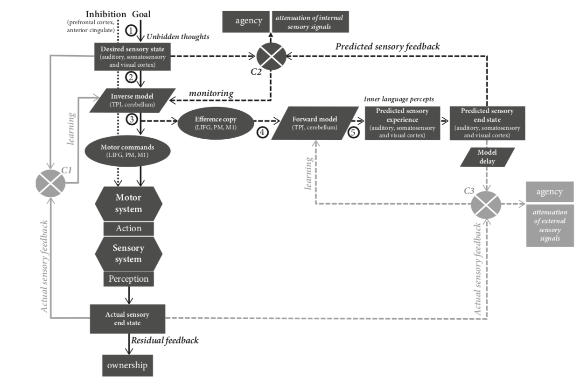

# (PART) Theoretical chapters {-}

# Theoretical framework {#intro}

```{r setupCH1, echo = FALSE, message = FALSE, warning = FALSE, results = "hide"}
knitr::opts_chunk$set(
  cache = TRUE, echo = FALSE, warning = FALSE, message = FALSE,
  out.width = "100%", fig.pos = "H", fig.align = "center"
  )
```

\epigraph{Inner speech is nothing but speech to oneself}{Sokolov, A. N. (1972)}

\initial{A}s you read these words, you might notice the presence of a familiar companion. A voice-like phenomenon that remains unnoticed until we pay attention to it. However, if I ask you to focus on that little voice while you are reading these lines, you would probably be able to provide a relatively fine-graind description of this thing that we call inner speech. Whose voice is it ? Is it yours ? Is it gendered ? It is usually possible to examine these aspects as well as more low-level features like the tone of this soundy companion, its pitch, its tempo, or virtually any sensory aspect of it. This first set of very basic observations already provide us some very important insights. First, if we can think about inner speech, then it should be something different from thinking itself. Rather, inner speech (or *covert speech*) can be construed as *a* vehicle for conscious thought (instead of *verbal thinking*, for instance)^[We will not delve on the touchy question whether inner speech is a necessary condition for consciousness. For the current purpose, it is sufficient to say that thinking and inner speech are ontologically separable.]. Second, the set of observations we can make about our inner voice also tautologically reveals that inner speech is accompanied by sensory percepts (sounds, kinaesthesic feelings, etc.). It thus raises another set of fascinating questions about the origin and nature of inner speech percepts: where do these percepts come from ? Why do they look like the one we experience when we *actually* (overtly) speak ?

This first set of questions refer to the *nature* of inner speech, that is, *what* is it ? In the current work, we are mostly concerned with this first question. Another related set of fascinating questions revolve around the *function* question, that is, *what is it for* [e.g.,@alderson-day_inner_2015] ? The influential Vygotskian theory of inner speech development suggests that inner speech evolves from *private speech* (i.e., self-adressed overt speech) during childhood. As such, we (as others have argued elsewhere) postulate that the functions of inner speech are inherited from the functions of private speech, via a mechanism of internalisation. The specific features of this internalisation processs are worthy of investigation on their own (and we briefly discuss them later on) but we are mostly interesred in the *what is* (the nature) question here. Thus, we will only sparsely address the *functions* question in the following text.

That being said, it is interesting to look at situations in which these functions do not work as intended. These *dysfunctions* [that can also be considered as *mis-exadaptation*, @agnati_possible_2012] are as spread as...

Rumination can generally be understood as transdiagnostic processes (i.e., a process that is not specific to a single pathology), and cover various...

## Rumination as a form of repetitive negative thinking

### Theoretical perspectives on rumination

The cognitive approach [@Koster2011;@Koster2013]... from the RST to contrl theories and the mental habit theory...

As suggested by @christoff_mind-wandering_2016, rumination and other forms of spontaneous thoughts can be considered in a common conceptual space (see Figure 1). This space is built upon two dimensions: *deliberate constraints* and *automatic constraints*. These dimensions represent two general mechanisms that allow to constrain the contents of these related mental states and the transitions between them. The first contrain correspond to a deliberate processus and is implemented through **cognitive control** [@miller_prefontral_2000]. The second constrain is referring to more automatic constrains like sensory afferences. In this framework, rumination is characterised by the highest level of automatic constraints and spread all along the *deliberate constraints* dimension.

```{r conceptual, echo = FALSE, fig.align = "center", out.width = "75%", fig.cap = "Conceptual space of different types of thought (Christoff et al., 2016)"}
knitr::include_graphics("assets/conceptual_space.png")
```

...

### On the verbal and sensory properties of rumination

...

## What is that little voice inside my head ?

### Brief historical overview of inner speech investigations

Description, functions, nature...

Soviet psychology... marxist psycohlogy... Akhutina (2003) highlihghts a distincion between the study of inner speech (and speech production in general) in the west based on linguistics and chomsky work, and its origin in marxist psychology in the east, where language is to be though in relation to its usages...

Vygostky essential properties of inner speech: i) abbreviation, the phonetic aspect is "diminished", reduced, "In inner speech we do not need to pronounce a word in its entirety. We understand, by virtue of our very intention, what word we wanted to say... Strictly speaking, inner speech is almost wordless" (Vygotsky, 1956, p. 368). ii) predicativeness, "Psychologically, inner speech consists of predicates only"; "the subject of our inner reason is always present in our thought"; it is always implicitly understood (Vygotsky, 1956, pp. 364, 365), iii) it has a semantic structure of its own: predominance of *sense* over *meaning*^[this refers to Paulhan's distinction between the dictionary *meaning* of a word on one hand, and the individual *sense* (menaning) of a word, acquired by usage, on the other hand.], it is idiomatic, agglutination of semantic units, etc.

Therefore, for Vygostky, it follows that the passage from inner speech to overt speech consists not in simply "vocalising" inner speech but in *restructuring* inner speech (e.g., retrieving a yntax proper to overt speech, retrieveing the phonetic structure, etc)...

In the last chapter of this book, Vygotsky analyzes the relationship between thought and word in the mature mind. The central idea of this chapter is stated as follows:

> The relationship between thought and language is not a thing, but a process, a continual movement back and forth from thought to word and from word to thought. Viewed in the light of a psychological analysis, this relation is a process that passes through a series of phases and stages, during which its essential features undergo changes that may be called development in the strict sense. Of course, this is a functional development, not development in the sense of aging; but the path traversed by thinking as a process from thought to word is development nonetheless.

Vygotsky ends this statement with his famous dictum: *Thought is not expressed in words; it comes into existence through them* (1956, p. 330)...

```{r vygotsky, out.width = "75%", fig.cap = "Vygotsky’s Levels in the Process of Verbal Thinking. Figure from Akhtuina (2003)."}

```

For Luria (1956), a verbal utterance usually starts with a *motive*^[This includes desires and needs, interests and impulses, affects and emotions, etc.], that is something to express. For Luria, a veral utterance always starts with a *vague thought* and the role of inner speech would be to transform this though into speech. Three stages i) the motive ii) the thought and its transformation to inner speech and iii) transofrmation to external speech... in his studies of aphasia, Luria (1947) then recognises thateach of these stages can be (more or less) independently impaired)...

*Copy-pasted from Akhutina (2003): The way was paved for this hypothesis by Soviet psychology and its notion of the multilevel structure of inner speech (Anan’ev, 1946, 1960; Sokolov, 1959, 1968). In Anan’ev’s view, one of the indisputable postulates of inner-speech theory is “that inner speech is a process that varies in terms of its readiness to be transformed into external speech.” For Anan’ev, inner speech has the following phases...*

@watson_psychology_1919 suggested that thought was rooted in (overt) speech, with maturation leading from speech to thought.. this hypothesis also applied to reading, with beginning reader overtly reading and progessively silently reading...

See reed 1916 for an historical perspective... this initial suggestion (by watson) lead to a fruitful line of research about the muscular bases and/or correlates of thought and inner speech...for instance, Reed (1916) observed that participnts were moving their tongue and lips (and sometimes whispering) while reading...

In a small monograph, @stricker_studien_1880 reported that... however, Paulhan (1886) replied that he was able to produce (innerly) the vowel 1 and maintan the image of other vowels and that he was able to imagine the sound of any vowel without motor actions or feelings (images). Maybe this debats illustrates the limitations of the introspective method...which gives birht to experimental methods atthe beginning of the last century... for instance reed (1916) desrbies an apparatus to examine tongue movements (see Figure XX) and an experiment to examine the inovlvment of inner spech (and speech motor processes) in thinking...

```{r reed, out.width = "50%", fig.cap = "Figure 1 \\& 2 from Reed (1916), describing the apparatus used to record tongue movement during thinking and inner speech."}
knitr::include_graphics("assets/reed.png")
```

Faaborg-Anderson and Edfeldt (1958) found that activity in vocal musculature increased with difficulty of text [see also @sokolov_inner_1972]... however it is not clear that reading always entails inner speech and (or more precisely), that inner speech always involve "sub-articulation"...discuss counter-examples by the "anesthesists" [e.g.,@smith_lack_1947]...

Historical perspective on the exploration of the role of motor processes in inner speech, from @sokolov_inner_1972. Dodge (1898) anesthetised his lips and tongue and ralised that is not impact on his inner speech. Curtis (1899) and Courten (1902) recorded laryngeal movements using a pneumatic drum and a kymograph while his participants recited verses or were reading. They observed that laryngeal movement were not always present and depended on what was being read and/or produced, as well as on the "degree of understanding"...

<!-- \begin{landscape} -->

```{r timeline, out.width = "100%", fig.cap = "Non-exhaustive overview of contemporary inner speech research from 1850 to present days."}
knitr::include_graphics("assets/timeline.pdf")
```

<!-- \end{landscape} -->

@jacobson_electrical_1931 used a galvanometer to record action potentials of tongue and lips muscles and observed small musles contraction during inner speech production, "as if words were pronounced in a rapid and abbreviated manner" [cited in @sokolov_inner_1972, p.45].

The discussion of inner speech in soviet Psychology resolved mostly around the issue of the functions of inner speech. The work of Lev Vygotsky and PP Blonsky (for instance) culminted in si suggesting that inner speech is speech "to oneself" and "for oneself". Interestingly, Vygotsky rejected both the verbal memory view of inner speech (i.e., inner speech is simply the retrieval of acoustic, optic or motor images of words) and the behaviourist view of inner speech as merely a soundless form ox external speech (à la Watson). For Vygotsy, the most dtermining factors of inner speech are its semantic features...

Concerning the development of inner speech, Vygostky considered that inner speech likely dervies from the *egocentric speech*^[According to Piaget, the egocentric speech is a conversation of the child aloud with herself.] of the preschool child. This lead Vygostky to claim a functional equivalence between egocentric speech and internal speech, the later resulting from a progressive internalisation of the former...

Vygostky... high *predicativeness* of inner speech (no subject), because we know what we are talking about... abbreviateness...

@sokolov_inner_1972 provided seminal observations that inner speech is involved during reading, to an extent that is diretly related to the difficulty of the ongoing reading task. More precisely, he observed that the more difficult the task was, the stronger the "speech motor impulses" (EMG amplitude) in the speech muscles. Moreover, the difficulty of the task was also related to the abbreviateness of inner speech. Simpler reading tasks were associated with abbrevaiated (condensed) inner speech whereas difficult tasks were associates with "unfolded" (expanded) inner speech, and sometimes externalised (overt) speech... @sokolov_inner_1972 also show shown that, reciprocally, restrictiing the articulators of the participants (e.g., by clamping the tongue or lips) impaired the ability of the participants to complete the task...

On the rate of inner speech as compared to overt speech, see @anderson_speech_1982, @mackay_problem_1981...it would be 15% to 20% faster than overt speech [@coltheart_phonological_1999]...

### Theoretical perspectives about inner speech production

The inner voice as the sensory consequence (prediction, see Loevenbruck et al., 2018) of imagined speech. Analogy with raising the arm: what we perceive when we imagine raising our arm are the sensory consequences (e.g., visual) of what would happen if we actually raised our arm, these are then kind of predictions. The same thing happens during inner speech production: the inner voice is the predicted auditory consequence of actual speech, except that it’s predicted. The two actions might seem very different, partly because of differences in the degree of automaticity. Imagining raising our arm might need a voluntary/deliberate/conscious (choose a word) intention (i.e., I want to raise my arm > I raise my arm) while speech imagery (i.e., inner speech) seems more automatic: we do not expression consciously the intention to speak, we just speak...

Argument about phonological activation during reading, see @abramson_what_1997, cited in @ehrich_vygotskian_2006... inner speech seems most prominent in beginning readers, or when processing difficult texts (Coltheart, Besner, Jonasson, & Davelaar, 1979)...

@abramson_what_1997 investigated the vowel-length effect (i.e., the fact that the length of the produced vowel depend on the surrounding consonants) was present in inner speech...they shown (in a lexical decisin task) that the response time was slowr to long-vowel stimuli than to short-vowel stimuli...but they do note, interestingly, that heir data do not indicate that inner speech is "*necessayr* for reading; it may simply be epiphenomenal" [@abramson_what_1997, p.1066]...

@huey_psychology_1968 proposed that phonological representations during reading were auditory...he propsoed that reading involves some form of auditory imagery, the voice in the head (or *inner hearing*)...he explained that this voice becams more and more abbreviated (and therefore less auditorily sailliant) as reader become more skilled [as explaned in @abramson_what_1997]...in the same vein, @stricker_studien_1880 prposed that (silent) reading was impossible without movements of larynx and lips...

#### The working memory perspective

...@baddeley_working_1986 introduces in his model the osbvocal rehearasal component, whose role is to prevent decay in short term memory. This tripartite model comprise one central exectuvie system and two slave systems. Within these slaves systes, verbal information is rehearsed within the phonological store throuhg a meachnism know as the phonological loop, acting to prevent memory loss in short term memory or working memory...

...whereas studies have shown that children can store verbal information, the active (silent) rehearsal of verbal information seems somehow "deficient" before the age of 7 years [e.g.,@flavell_spontaneous_1966]... which is coherent with the Vygostkian predictions discussed earlier...

#### MVTV Cohen (1986)

...

#### Predictive models

...

Speech production involves the fine-grained coordination of more than 100 muscles in the upper part of the body [@simonyan_laryngeal_2011]. In adult humans, its covert counterpart (i.e., *inner speech* or *verbal imagery*) has developed to allow the full reconstruction of usual overt speech situations. In the same way as visual imagery allows to mentally examine visual scenes, *verbal imagery* can be used as an internal tool, allowing --amongst other things-- to rehearse or to prepare past and future speech situations [for a review, see @Perrone-Bertolotti2014]. In consideration of its self-evident motoric nature, a parallel can be drawn between verbal imagery and other forms of motor imagery (e.g., imagined walking or imagined writing). As such, inner speech studies might benefit from insights gained from the study of motor imagery and the field of motor cognition [e.g.,@haggard_conscious_2005;@jeannerod_motor_2006].

The process of speech internalisation might be similar the inernalisation of any kind of motor action. Considering inner speech as any other form of morot action brings some interesting insights. If speech production can be broadly described as the coordinated motion of (groups of) muscles that result in some predictable sensory consequences (e.g.,, auditory, visual, kinesthesic or somesthesic feelings), then it can be compared to other forms of action. In that sense, the process of speech internalisation, as the process of "internalised walking", might follow the same general steps. This process can be broadly defined as the learning of the mapping between some muscular command or patterns of muscular commands and the associated sensory consequences. Learning these associations result in the elaboration of an internal model of the mapping, that permit to predict ongoing actions, but also to simulate these actions in the absence of any overt movement. In that sense, the process of inner speech might be considered under the broad category of imagined actions...

Let’s consider the analogy between speaking and playing an instrument (e.g., the piano). Learning how to play piano can be reduced to the learning and coordination of complex and fine motor sequences, that in turn produce sensory (kinestheatic, auditory, visual, etc) feedback to the producer of the action (the agent). It seems that (from a certain level of analysis), the act of speech can be paralleled with the act of playing an instrument in that it consists in the coordination of infinitely complex movements that result in some modifications in the environment, that in turn generate sensory feedbacks for the agent. Thus, pursuing the analogy, we could argue that imagining playing an instrument and imagining speaking (i.e., producing inner speech) might rest on similar mechanisms (e.g., see O’Shea & Moran, 2018).

This view is somehow consistent with the Vygotskian view of inner speech as internalised egocentric (or private) speech but it proposes a formal mechanism to explain it...

#### Loevenbruck et al., HMOSAIC

...

```{r loevenbruck, out.width = "75%", fig.cap = "..."}

```

#### Action representation and internal models

Voir @jeannerod_representing_1994 and @wolpert_internal_1995, Wolpert & Gharamani (2000)...

\vspace{2mm}

\begin{mybox}[label = model]{What is an internal model ?}

Blah blah...

\end{mybox}

...

## Theoretical perspective on motor imagery

Considerable experimental evidence has accumulated to suggest that movement execution and motor imagery share substantial overlap of active brain regions [for review, see @guillot_imagining_2012]. Such apparent functional equivalence supports the hypothesis that motor imageru draws on the similar neural networks that are used in actual perception and motor control [@grzes_functional_2001;@jeannerod_representing_1994]...

See introduction of O’Shea (2017) PhD thesis introduction... See Stinear’s chapter in Guillot’s book for intracortical and spinal mechanisms involved during motor imagery (p.55-57).

### Overt and imagined actions

Wittgenstein’s (1953) famous query: "When I raise my arm, what is left after subtracting the fact that my arm raised?". We posit that what is left is an internal model (a representation) of what should happen if and when my arm goes up [@jeannerod_25th_1999]...

### The motor simulation theory

In his seminal paper, @jeannerod_representing_1994 introduces the idea of a close functional equivalence between motor imagery and motor preparation, as suggested by the similar neural and physiological correlates observed in both imaging and preparing (and by the effects of motor imagery on motor learning and training). According to Jeannerod, actions are driven by an "internally represented world rather than directly by the external world" (page 187). In the next paragraph(s), Jeannerod seems to equate motor representations with motor images or what he calls *pragmatic representations* (page 187). For Jeannerod, motor imagery is a part of a broader phenomenon (the motor representation) related to intending and preparing movements (page 189). He also echoes the distinction (coming from sport psychology) between *internal* (imagining an action from the first perspective, which would be more kinesthesic) and *external imagery* (imagining an action from the third perspective, which would be more visual). For him, motor imagery necessarily belongs to the former type (page 189), whereas the term of *motor imagery* in sport psychology seems to more broadly ecnompasse both first-person and third-person motor imagery [e.g.,].

Motor preparation is unconscious while motor imagery is conscious. However, Jeannerod suggests that the difference between the two might be a difference of degree, rather than one of kind, as the difference between the two would only be determined by the time spent on each (i.e., if one makes motor preparation lasting for longer than it’s usually needed, it can “become” motor imagery, page 190). In plain words, the idea is that motor representations/intentions become known to the subject when they are not followed by execution (page 190), so there would be a continuum between motor preparation and motor imagery.

EMG lines of evidence page 191: Eye movements have been recorded during the recall of visual scenes (e.g., Jeannerod & Mouret 1962). Jacobson (1930) first suggested that muscles were selectively activated during imagined action. Shaw (1940) reported that during imagined weight lifting, electromyographic (EMG) activity of forearm muscles increased linearly with the magnitude of the weight, etc.

Neural structures and physiological correlates page 192-193.

Evidence from mental chronometry and temporal equivalence (e.g., Landauer, 1962), showing that it takes approximately the same amount of time to say the alphabet or series of numbers aloud and to think them to himself.

The famous walking + load experiment of @decety_timing_1989 reveals that force, rather than duration, is the encoded variable, and that estimated duration is merely derived from the level of centrally represented force. When the subjects carried the load, they centrally programmed a greater force to overcome any resistance, because subjects did not actually walk (page 194). For Jeannerod, the programming of force as a subjective correlate: the sensation of effort, which can become perceptible to the actor independently of overt movement execution and can be monitored experimentally (page 194). Page 196: representation of kinematic regularities (e.g., Fitts’ law, Viviani’s experiments, etc.).

In the following (section 5, starting page 197), Jeannerod develops the idea that the goal of an action includes an internal representation of both the external object toward which it is directed and the final state of the organism when that object has been reached. Then, he develops on the idea of a distinction between a pragmatic mode and a semantic mode (page 198).  He also makes a distinction between two functions of representations: a sensory one (to extract from the external world the attributes of objects or situations that are relevant to a given action) and a motor one (to encode some aspects of that action) (page 199).

NB: in this paper (Jeannerod, 1994), there is no explicit mention of a “simulation” process… Jeannerod only discusses the conscious access to the content of a representation, and defines it as motor imagery (cf. notes above as well as the distinction drawn by Grush, 2004). Interestingly, in the commentaries, Morton suggests that many of the cases Jeannerod reports are actually instances of simulations, rather than mere imagination, because these cases contain part of what would be involved in actual performance (page 215). In his response, Jeannerod seems to agree with and to endorse this view (e.g., page 231).

In the commentary of this paper Gursh suggests that... (Motor models as steps to higher cognition (Rick Grush)) there should exist an inverse model, and points that nothing mentioned in the target article is actually capable of generating mental imagery. For Grush, this inverse model would act centrally, taking as input the efferent copy (for instance) and would output a mock version of the afferent signals the peripheral system would have produced given the same input (i.e., an emulator, see page 209).

For @jeannerod_mental_1995, motor imagery is necessarily first-perspective. Third perspective imagery is imagery, but not MOTOR imagery... Motor representations are conceived here as 'internal models' of the goal of an action.

In @jeannerod_neural_2001, "Covert and overt stages thus represent a continuum, such that overtly executed action implies the existence of a covet stage, whereas a covert action does not necessarily turns out into an overt action" (page S103). Jeannerod introduces the term S-states to designate mental stats which involve an action content and where brain activity can be shown to simulate that observed during the same, executed, action. These S-states correspond to intended action, imagined action, and many others (see Table 1, page S104).

In @jeannerod_motor_2006, The Simulation Hypothesis of Motor Cognition (pages 129-164). See Schematic summary of motor simulation according to Jeannerod (page 133).

"Simulation is used here as the off-line rehearsal of neural networks involved in specific operations such as perceiving or acting (page 129). According to our view [...], the simulation relates not to complete actions but to unspecific elements that comprise actions. Motor representations are automatically assembled in response to immediate task requirements and do not rely on memorized actions (page 134)."

The peripheralist versus centralist interpretation of physiological inner speech correlates (page 153): Subvocal speech was first interpreted as a source of peripheral kinesthetic information which, when projected to central nervous structures, generated auditory images of the corresponding words. The same interpretation was given to the low intensity EMG recorded during mental motor imagery of limb actions, which was thought to be the origin of the feelings experienced by the subject during mental rehearsal (Jacobson 1930), or to the eye movements recorded during mental visual imagery (e.g. Brandt and Stark, 1997). However, this interpretation of mental processes as consequences of peripheral feedback is now disproved by recent experiments showing complete absence of muscular activity in many subjects during motor imagery. When present, this activity is rather assumed to be a consequence of incomplete inhibition of motor output during mental states involving motor simulation. This same interpretation might also hold for inner speech.

Motor imagery can be defined as the mental process by which one rehearses a given action, without engaging in the physical movements involved in this particular action. One of the most influential theoretical explanation of this broad phenomenon, the *motor simulation theory* [MST,@jeannerod_representing_1994;@jeannerod_neural_2001;@jeannerod_motor_2006], contains the three following postulates at its core: i) there exists a continuum between the covert (the mental representation) and the overt execution of an action, ii) action representations can operate off-line, via a *simulation* mechanism, and iii) covert actions rely on the same set of mechanisms as the overt actions they simulate, except that execution is inhibited [@oshea_does_2017].

In this framework, the concept of simulation refers to the "offline rehearsal of neural networks" [@jeannerod_motor_2006], and motor imagery is conceptualised as a simulation of the covert stage of the same executed action [@oshea_does_2017]. The MST shares some similarities with the theories of embodied and grounded cognition [@Barsalou2008] in that both allow to account for the phenomenon of motor imagery by appealing to a simulation mechanism. However, the concept of simulation in grounded theories is assumed to be multi-modal (not just motoric) and to operate in order to achieve a particular abstract knowledge [@oshea_does_2017], which is not the concern of the MST^[We should also make a distinction between *embodiment of content*, which concerns the conceptual content of language, and *embodiment of form*, which concerns "the vehicle of thought", that is, proper speech production [@pickering_integrated_2013].].

The MST is supported by a wealth a findings, going from mental chronometry studies showing that the time taken to perform an action is often found to be similar to the time needed to imagine the corresponding action [though not always, see @glover_motor-cognitive_2017, for a review of controversial findings and for an alternative conceptualisation of motor imagery], to neuroimaging and neurostimulation studies showing that both motor imagery and overt actions tend to recruit similar frontal, parietal and sub-cortical regions [e.g.,@hetu_neural_2013;@jeannerod_neural_2001]. The involvement of the motor system during motor imagery is also supported by repeated observations of autonomic responses and peripheral muscular activity during motor imagery (we discuss these observations in section XX).

\vspace{2mm}

\begin{mybox}[label = centralism]{Centralism versus peripheralism}

The motor theory of perception: mental states arise from movement (more precisely, from innervation associated with movements (the perceived image of an object arises from the muscular discharges produced during the movements involved in exploring it). The peripheral variant of the motor theory is the idea according to which the mental image of that object is also produced by covert muscular discharges in the related muscles (cf. work from James, 1890; Jacobson, 1930).\\

But the idea developed in this paper is quite the reverse of the peripheral motor theory and would be more akin to a centralist version of the motor theory (page 190). Jeannerod says that existence of muscle discharge during a mental state does not imply a bottom-up influence of these discharges on the mental state. The key phenomenon in Jeannerod’s conception is the motor intention, which is though to be largely endogenous (page 190). Motor imagery would represent the results of conscious access to the content of the intention, and the content of the intention would constrain the expression of the image (page 190). Jeannerod also states that this view is in agreement with the corollary discharge model. The key idea is that the activation of peripheral mechanisms is not needed to generate the image (but they can be activated, as a consequence of the activation of the image/representation)...

\end{mybox}

### Emulation and internal models

NB: in this paper emulator is used as a synonym for "forward models" (pages 378-379)...

@grush_emulation_2004 proposes a unified framework for explaining a wide variety of representational functions of the brain: the emulation theory of representation. This theory has its origins in control theory (forward models) and signal processing (Kalman filters).

Difference between emulation theory of motor imagery and simulation theory à la Jeannerod (pages 384-385): "[...] Given these definitions, it should be clear that the simulation theory and the emulation theory are not at all the same thing. They agree that the efferent motor centers are active during imagery. The simulation theory takes this by itself to be sufficient for motor imagery; the emulation theory does not, and claims that in addition, an emulator of the musculoskeletal system is needed and imagery is produced when the efferent motor centers drive this emulator. This distinction should be entirely obvious. To make an analogy: The emulation theory claims that motor imagery is like a pilot sitting in a flight simulator, and the pilot’s efferent commands (hand and foot movements, etc.) are translated into faux “sensory” information (instrument readings, mock visual display) by the flight simulator which is essentially an emulator of an aircraft. The simulation theory claims that just a pilot, moving her hands and feet around but driving neither a real aircraft nor a flight simulation, is sufficient for mock sensory information."

Distinguishing between simulation and emulation theories (page 385): "[…] The only way to get from the former (signals in motor format) to the latter (signals in proprioceptive and kinesthetic format) is to run the motor signal through something that maps motor plans/signals to proprioception and kinesthesis. And the two possibilities are (a) the body (yielding real proprioception and kinesthesis), and (b) a body emulator (yielding faux proprioception and kinesthesis) […] A motor plan is one thing, a sequence of proprioception and kinesthesis is another. The simulation theorist conflates them."

In @moulton_imagining_2009, In brief: they tried to characterize mental imagery as an information processing system, considering it in the perspective of Marr’s three levels of explanation (i.e., the computational, algorithmic, and implementation levels).

Imagery is also characterized by its reliance on perceptual representations and activation of perceptual brain systems. We use this conception of imagery to argue that all imagery is simulation— more specifically, it is a specific type of simulation in which the mental processes that ‘run’ the simulation emulate those that would actually operate in the simulated scenario. This type of simulation, which we label emulation, has benefits over other types of simulations that merely mimic the content of the simulated scenario.
They note (page 1273): "[…] ‘motor imagery’ (which actually appears to be proprioceptive or kinaesthetic imagery—one experiences the bodily sensations of movement, not the movement commands themselves: Jeannerod, 1994)."

A second class of explanatory models of motor imagery are concerned with the phenomenon of *emulation* and with *internal models* [see @gentsch_towards_2016, for a review of the similarities and dissimilarities of simulation and emulation models].

Internal model theories share the postulate that the motor system is represented by *internal models*, whose function is to estimate and anticipate the outcome of a motor command. One of its variant, the *motor control theory* [e.g.,@kawato_internal_1999;@wolpert_internal_1995], assumes two kind of models: a forward model that predicts the sensory consequences of motor commands from efference copies, and an inverse model that calculates the feed-forward motor commands from the desired movement [@gentsch_towards_2016].

Emulation theories [e.g.,@grush_emulation_2004;@moulton_imagining_2009] borrow from both previously discussed framework (i.e., simulation theories and internal model theories) to posit a specific kind of simulation. While the MST postulates that during simulation the motor system is guided exclusively by internal motor representations, the emulation theories suggest that both motor and sensory systems are emulated in parallel [@grush_emulation_2004;@oshea_does_2017].

In the emulation model proposed by @grush_emulation_2004, the *emulator* is a device that implements the same input-output function as the body (i.e., the musculoskeletal system and relevant proprioceptive/kinaesthetic systems). When the emulator receives a copy of the control signal (which is also sent to the body), it produces an output signal (the emulator feedback), identical or similar to the feedback signal produced by the body^[In Grush's terminology, *emulator* is used as a synonym for *forward models* [see @grush_emulation_2004, pages 378-379].]. This feedback would be responsible for the presence of sensory percepts (e.g., visual, auditory, kinaesthetic) during motor imagery.

One important difference between the emulation theory of motor imagery and the MST though, is that the latter takes the mere activation of efferent motor centres as being sufficient for explaining motor imagery, while the emulation theory postulates that an emulator of the musculoskeletal system is needed [@grush_emulation_2004, pages 384-385]. @grush_emulation_2004 suggested an analogy to illustrate this difference: "The emulation theory claims that motor imagery is like a pilot sitting in a flight simulator, and the pilot’s efferent commands (hand and foot movements, etc.) are translated into faux “sensory” information (instrument readings, mock visual display) by the flight simulator which is essentially an emulator of an aircraft. The simulation theory claims that just a pilot, moving her hands and feet around but driving neither a real aircraft nor a flight simulation, is sufficient for mock sensory information". Alternatively, in the words of @moulton_imagining_2009, instrumental simulations (à la Jeannerod) can be thought of as *first-order* simulations that imitate the content of the simulated action, while emulative simulations can be thought of as *second-order* simulations that imitate both the content and the processes that change the content.

## Electromyography of covert actions

### Explaining the muscular activity during motor imagery

Motor imagery has consistently been defined as the mental rehearsal of a motor action without any overt movement. One consequence of this claim is that, in order to prevent execution, the neural commands for muscular contractions should be blocked at some level of the motor system by active inhibitory mechanisms [for a review, see @guillot_imagining_2012]. Despite these inhibitory mechanisms, there is now abundant evidence for peripheral muscular activation during motor imagery [for a review, see @guillot_contribution_2005;@guillot_imagining_2012]. As suggested by @jeannerod_representing_1994, the incomplete inhibition of the motor commands would provide a valid explanation to account for the peripheral muscular activity observed during motor imagery. This idea has been corroborated by studies of changes in the excitability of the motor pathways during motor imagery tasks. @bonnet_mental_1997 measured spinal reflexes while participants were instructed to either press a pedal with the foot or to simulate the same action mentally. They observed that both H-reflexes and T-reflexes increased during motor imagery, and that these increases correlated with the force of the simulated pressure. Using transcranial magnetic stimulation and motor evoked potentials (MEPs), several investigators observed muscle-specific increases of MEPs during various motor imagery tasks, while no such increase could be observed in antagonist muscles [e.g.,@fadiga_corticospinal_1999;@rossini_corticospinal_1999]^[As a side note, we should remark that these findings are consistent with both the simulation and the emulation views on motor imagery.].

\vspace{2mm}

\begin{mybox}[label = inhibition]{The motor inhibition problem}

The problem of inhibition (page S106): how come that covert actions, in spite of activation of the motor system, do not result in muscular activity and overt movements? Two possibilities:\\

*	Subliminal activation during S-states, insufficient to fire spinal motoneurons

*	Or, activations would be blocked/attenuated before to reach the motoneurons by an inhibitory mechanism generated in parallel to the motor activation...\\

NB: these two possibilities are not necessarily incompatible...

\end{mybox}

Interestingly, the dominant interpretation of the muscular correlates of motor imagery at the beginning of the last century was that the peripheral muscular activity observed during imagined actions was the *source* of the mental content. However, as explained by @jeannerod_motor_2006, this interpretation of mental processes as a consequence of peripheral feedback is now disproved, for instance by the simple fact that many people can experiment motor imagery, without any observable muscular activity^[The *peripheralist* interpretation has also been disproved by the heroic experiment carried out by @smith_lack_1947. Smith used d-tubocurarine (curare) to paralyse his own facial muscles in order to test this interpretation. He later reported that, while being paralysed, he was still able to think in words and to solve mathematical problems.]. In the most recent theoretical explanations of motor imagery (e.g., MST, emulation or internal models theories), the peripheral activity is rather assumed to be a consequence of an incomplete inhibition of motor output during the mental states involving motor simulation/emulation (i.e., these views adhere to a *centralist* interpretation of the physiological correlates of inner speech).

### Controversial findings

As reviewed in @guillot_electromyographic_2010, although there are many observations showing a peripheral muscular activity during motor imagery, there are also many studies failing to do so, or reporting surprisingly high levels of inter-subject variability, with some participants showing no muscular activity at all. Putting aside the discussion on the exact nature and location of the inhibitory mechanisms during motor imagery [see @guillot_imagining_2012], two main explanations have been advanced to resolve these discrepancies. First, the electromyographic activity recorded during motor imagery could be moderated by the perspective taken in motor imagery. We usually make a distinction between a first-person perspective or *internal imagery* (i.e., imagining an action as we would execute it) and a third-person perspective or *external imagery* (i.e., imagining an action as an observer of this action), that seem to involve different neural and cognitive processes. It has been shown that a first-person perspective generally results in greater EMG activity than motor imagery in a third-person perspective [@hale_effects_1982;@harris_effects_1986]. Second, some authors postulated that the intensity of the EMG activity recorded during motor imagery might be related to the individual ability to form an accurate mental representation of the motor skill (i.e., the vividness of the mental image). However, after reviewing the available evidence, @guillot_brain_2009 concluded that this is unlikely to be the case. Alternatively, discrepancies in experimental design and methodological choices (e.g., use of intramuscular versus surface electromyography) could also explain these different results [@guillot_electromyographic_2010].

In the next section, we turn to a discussion of inner speech conceptualised as a kind of motor (and sensory) imagery of speech, and discuss the theoretical underpinnings of this proposition as well as the available empirical evidence in its support.

### Electromyographic correlates of inner speech production

Various terms: internal speech, silent speech, covert speech, implicit speech, speech imagery... difference between generative component (mackay, 1992) / inner speaking / inner voice and perceptual or auditory component (MacKay, 1992) or inner hearing / inner ear...

A key question: what is the lowest level of specification of inner speech ? ... figure from oppenheim & dell (2010...)

See MacKay (1992, page 131) for discussion of speaking rate in inner and overt speech... faster rates also occur for other highly trained skills (e.g., tying a shoelace, Annett, 1988)...ref to review of Guillot...

EMG during inner speech (from mckay, 1992): "interestingly, this same EMG activity invariably precedes by a few milliseconds the full blown muscle activity that occurs during normal movements" (e.g., Schmidt, 1982)...

\vspace{2mm}

\begin{mybox}[label = garrity]{Proper control conditions in electromyographic studies of inner speech production}

Guidelines from Garrity (1977) here...

\end{mybox}

While grasping the concept of a visual image appears as relatively straightforward, it seems more difficult at first to grasp the concept of a motor image, especially when it comes to verbal imagery. The subjective experience of the tension that results from a given position of the articulators and the covert production of an incompatible speech sound permits to substantiate what a motor image is. For instance, it is generally impossible to generate the image of the pronunciation of the sound "b" while keeping the mouth wide opened [e.g.,@binet_psychologie_1886;@stricker_studien_1880]. This simple experiment allows defining imagined speech as the simulation of the corresponding overt verbal content, where *simulation* is meant to be understood either as the off-line rehearsal of neural motor networks involved in the overt action [@jeannerod_motor_2006], or in the terms of the emulation theories discussed previously^[Translated to speech, the MST is similar to previous proposals such as the *motor theory of voluntary thinking* [@cohen_motor_1986] or the hierarchical model of mental practice [@mackay_problem_1981].].

The model of wilful (voluntary) inner speech production introduced in @loevenbruck_cognitive_2018 goes one step further and, by building on the models of speech motor control [e.g.,@houde_speech_2011;@wolpert_internal_1995], describes inner speech as "multi-modal acts with multi-sensory percepts stemming from coarse multi-sensory goals". In other words, the auditory and kinaesthetic sensations perceived during inner speech prediction are assumed to be the predicted sensory consequences of speech motor acts, emulated by internal forward models, that use the efference copies issued from an inverse model [this proposal shares similarities with the emulation model of motor imagery discussed earlier, @grush_emulation_2004].

**Fin de l'intro old de zygoto...**

In other words, "inner speech is nothing but speech to oneself" [@sokolov_inner_1972]... it can be considered as a n internalisation, a psychological transofmration or "internal projection" of overt speech [@sokolov_inner_1972]...

<!-- about levelt model of speech production

However, it does not explicity account for how speech is *regulated* or *monitored* during its production. Speech production theories, in addition to being able to describe how speech is produced, its timecourse and caracteristics, should also be able to explain when and how speech production goes wrong, that is, when and how *speech errros* occur. These theories should also be able to explain how errors can be corrected and how speech, more generally, can be regulated. Several hypotheses have been emitted, that can be grouped under three main classes. Speech might be all programmed in advance, or there would be some *feedback control* during speech, or there would be a combination of both programmation and feedback control.

-->
