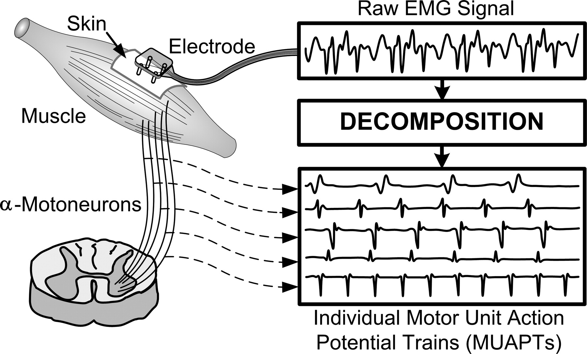

# Electromyographic correlates of speech production

...

## Speech production mechanisms

...

## Speech production muscles

...

## Muscular physiology

...

## EMG signal

### EMG signal measures

Muscular activity can be studied at different levels. At the cellular level, using electrophysiological measures like micro-electrods implanted in the cell, that allow direct measures of **action potential**. At the segmental level, biomechanis study muscular activity using surface sensors, positionned on the skin...intermediate levels...
 
### Motor Unit Action Potential

**Motor unit action potential** (MUAP) is the electric field resulting from the sum f the electric fiels emitted y each fiber of the motor unit. This train of action potentials will generate a *train* of MUAP, call **motor unit action potential trains** (MUAPT). The electric potential generated by this field is highly dependant of parameters such as the number of fibers, their length, speed of conduction and position of the neuromuscular junction.

```{r, echo = FALSE, fig.align = "center", fig.cap = "Motor unit action potential schema."}

```

...

EMG signal then result in a mixture of recruited motor units.

### Surface EMG

...*crosstalk* phenomenon [@DeLuca1997]. In reason of the important... of facial muscles, the EMG activity of one recorded muscle generally does not represent the activity of a single muscle but rather a mixture of...@Rapin2011...

### Basic signal processing

...the EMG signal is a stochastic signal... In order to illustrate what EMG signal looks like, we simulated EMG signal based on a standard algorithm [@Hermens1999,pp.70-71], implemented in R by @Borg2014.

```{r, echo = TRUE, prompt = TRUE, cache = TRUE, fig.align = "center", fig.pos = "h!", fig.width = 6, fig.height = 4, fig.cap = "Simulated EMG signal."}
source("code/EMGfuns.R")
emg <- EMG_sim(n = 2048, sampFreq = 1000, lF = 10, hF = 100)$sim
ts.plot(emg, xlab = "Time (ms)", ylab = "simEMG", col = "steelblue")
```

...we rectify the EMG signal by taking its absolute value and substracting the mean in order to correct for any offset (bias) present in the raw data. It is interesting to note that the effects of rectification on the EMG signal is similar to the rectification of AM radio waves whose purpose is to enhance the low frequency components, wich encode the voice signals. Concerning EMG, the "voice" of the signal corresponds to the encoded force [@Borg2007].

```{r, echo = TRUE, prompt = TRUE, cache = TRUE, fig.align = "center", fig.pos = "h!", fig.width = 6, fig.height = 4, fig.cap = "Rectified EMG signal."}
emg <- abs(emg - mean(emg) )
ts.plot(emg, xlab = "Time (ms)", ylab = "simEMG", col = "steelblue")
```

...

There are two main measures thant can be used to represent the magnitude of muscle activity. These two measures can be directly computed from the filtered EMG signal. The first one is the **average rectified value** (ARV):

$$ARV = \frac{1}{T} \sum_{t=1}^{T} | EMG(t_{i}) |$$

which is computed over a specific interval $(0,T)$ and where $|EMG(_{i})|$ is the absolute value of a datum of EMG in the data window. The unit of measurement is $mV$ or $\mu V$, and the ARV calculation is generally similar to the numerical formula for integration [@Kamen2010].

The second one is the **root-mean-square** (RMS) amplitude:

$$RMS = \sqrt \frac{1}{T} \sum_{t=1}^{T} | EMG^{2}(t_{i}) |$$

where $|EMG^{2}(_{i})|$ is the squared value of each EMG datum and has both physical and physiological meanings...
