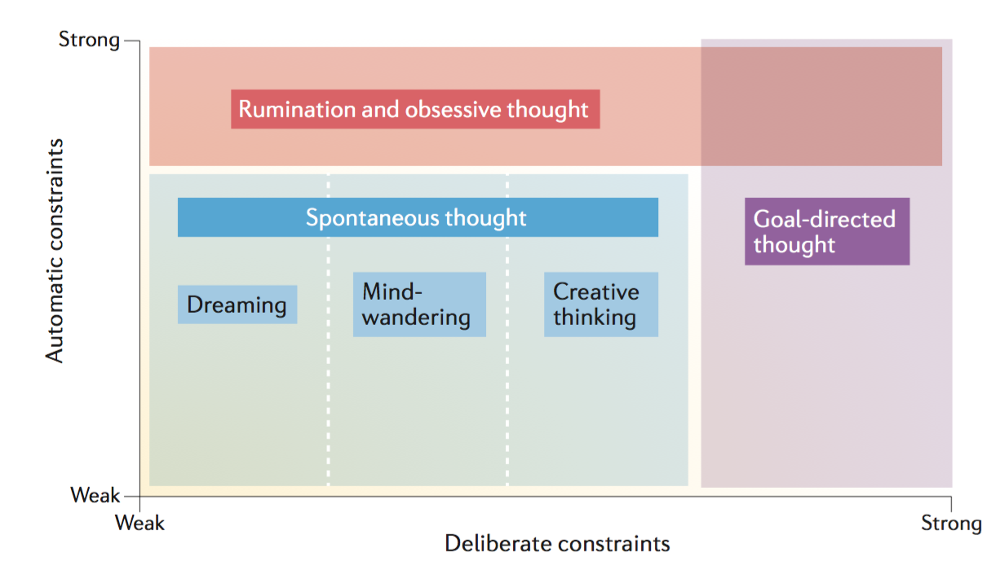

# (PART) Theoretical chapters {-}

# Theoretical framework {#intro}

\initial{A}s you read these words, you might notice the presence of a familiar companion. A voice-like phenomenon that remains unnoticed until we pay attention to it. However, if I ask you to focus on that little voice while you are reading these lines, you would probably be able to provide a relatively fine-graind description of this thing that we call inner speech. Whose voice is it ? Is it yours ? Is it gendered ? It is usually possible to examine these aspects as well as more low-level features like the tone of this soundy companion, its pitch, its tempo, or virtually any sensory aspect of it. This first set of very basic observations already provide us some very important insights. First, if we can think about inner speech, then it should be something different from thinking itself (réf ?). Rather, inner speech (or *covert speech*), can be construed as *a* vehicle for conscious thought (instead of *verbal thinking*, for instance)^[We will not dwell on the touchy question whether inner speech is a necessary condition for consciousness. For the current purpose, it is sufficient to say that thinking and inner speech are ontologically separable.]. Second, the set of observations we can make about our inner voice also tautologically reveals that inner speech is accompanied by sensory percepts (sounds, kinaesthesic feelings, etc.). It thus raises an interesting question: where do these percepts come from ? Why do they look like the one we experience when we *actually* (overtly) speak ?

This first set of questions refer to the *nature* of inner speech, that is, *what* is it ? In the current work, we are mostly concerned with this first question. Another related set of interesting questions revolve around the *function* question, that is, *what for* is it ? The influential Vygotskian theory of inner speech development suggests that inner speech evolves from *private speech* (i.e., self-adressed overt speech) during childhood. As such, we (as others have argued elsewhere) postulate that the functions of inner speech are inherited from the functions of private speech, via a mechanism of internalisation. The specific features of this internalisation processs are worthy of investigation on their own (and we briefly discuss them later on) but we are mostly interesred in the *what is* (the nature) question here. Thus, we will only sparsely address the *functions* question in the following text.

That being said, it is interesting to look at situations in which these functions do not work as intended. These *dysfunctions* [that can also be considered as *mis-exadaptation*, @agnati_possible_2012] are as spread as... They can generally be understood as transdiagnostic processes (i.e., a process that is not specific to a single pathology), and cover various...

...

Learning how to internalise speech might be similar to learning how to internalise playing an instrument... Let’s consider the analogy between speaking and playing an instrument (e.g., the piano). Playing piano results from the learning of an infinitely complex coordination of fine motor sequences, that in turn produce sensory (kinestheatic, auditory, visual, etc) feedback to the producer of the action (the agent). It seems that (from a certain level of analysis), the act of speech can be paralleled with the act of playing an instrument in that its consists in the coordination of infinitely complex movements that result in some modifications in the environment that in turn generate sensory feedbacks for the agent. Thus, pursuing the analogy, we argue that imagining playing pian and imagining speaking (i.e., producing inner speech) might rest on similar mechanisms… see O’Shea & Moran (2018) on expert pianists...

## Rumination as a form of repetitive negative thinking

Blah blah [@koster_rumination_2013]...

As suggested by @Christoff2016, rumination and other forms of spontaneous thoughts can be considered in a common conceptual space (see Figure 1). This space is built upon two dimensions: *deliberate constraints* and *automatic constraints*. These dimensions represent two general mechanisms that allow to constrain the contents of these related mental states and the transitions between them. The first contrain correspond to a deliberate processus and is implemented through **cognitive control** [@Miller2000]. The second constrain is referring to more automatic constrains like sensory afferences. In this framework, rumination is characterizsd by the highest level of automatic constraints and spread all along the *deliberate constraints* dimension.

(\#fig:conceptual)Conceptual space of different types of thought (Christoff et al., 2016)

**Copy-pasted from zygoto old intro...**

Speech production might be one of the most complex motor action ever studied. Involving the fine-grained coordination of more than 100 muscles in the upper part of the body [@simonyan_laryngeal_2011], its expression is shaped by a subtle combination of physiological, cultural and evolutionary determinants. In adult humans, its covert counterpart (i.e., *inner speech* or *verbal imagery*) has developed to allow the full reconstruction of usual overt speech situations. In the same way as visual imagery allows to mentally examine visual scenes, *verbal imagery* can be used as an internal tool, allowing --amongst other things-- to rehearse or to prepare past and future speech situations [for a review, see @perrone-bertolotti_what_2014]. In consideration of its self-evident motoric nature, a parallel can be drawn between verbal imagery and other forms of motor imagery (e.g., imagined walking or imagined writing). As such, inner speech studies might benefit from insights gained from the study of motor imagery and the field of motor cognition [e.g.,@haggard_conscious_2005;@jeannerod_motor_2006]. Whereas previous research have demonstrated that it is possible to record muscle-specific electromyographic correlates of inner speech production using invasive intramuscular needle electrodes, more recent research using surface electromyography lead to mixed results. Building upon previous work, we describe an experimental set-up using surface electromyography with the aim of refining the description of the involvement of the speech motor system during inner speech production.

## What is motor imagery ?

### The motor simulation theory

Motor imagery can be defined as the mental process by which one rehearses a given action, without engaging in the physical movements involved in this particular action. One of the most influential theoretical explanation of this broad phenomenon, the *motor simulation theory* [MST; @jeannerod_representing_1994;@jeannerod_neural_2001;@jeannerod_motor_2006], contains the three following postulates at its core: i) there exists a continuum between the covert (the mental representation) and the overt execution of an action, ii) action representations can operate off-line, via a *simulation* mechanism, and iii) covert actions rely on the same set of mechanisms as the overt actions they simulate, except that execution is inhibited [@oshea_does_2017].

In this framework, the concept of simulation refers to the "offline rehearsal of neural networks" [@jeannerod_motor_2006], and motor imagery is conceptualised as a simulation of the covert stage of the same executed action [@oshea_does_2017]. The MST shares some similarities with the theories of embodied and grounded cognition [@barsalou_grounded_2008] in that both allow to account for the phenomenon of motor imagery by appealing to a simulation mechanism. However, the concept of simulation in grounded theories is assumed to be multi-modal (not just motoric) and to operate in order to achieve a particular abstract knowledge [@oshea_does_2017], which is not the concern of the MST^[We should also make a distinction between *embodiment of content*, which concerns the conceptual content of language, and *embodiment of form*, which concerns "the vehicle of thought", that is, proper speech production [@pickering_integrated_2013].].

The MST is supported by a wealth a findings, going from mental chronometry studies showing that the time taken to perform an action is often found to be similar to the time needed to imagine the corresponding action [though not always, see @glover_motor-cognitive_2017, for a review of controversial findings and for an alternative conceptualisation of motor imagery], to neuroimaging and neurostimulation studies showing that both motor imagery and overt actions tend to recruit similar frontal, parietal and sub-cortical regions [e.g.,@hetu_neural_2013;@jeannerod_neural_2001]. The involvement of the motor system during motor imagery is also supported by repeated observations of autonomic responses and peripheral muscular activity during motor imagery (we discuss these observations in section \@ref(emg)).

### Emulation and internal models

A second class of explanatory models of motor imagery are concerned with the phenomenon of *emulation* and with *internal models* [see @gentsch_towards_2016, for a review of the similarities and dissimilarities of simulation and emulation models].

Internal model theories share the postulate that the motor system is represented by *internal models*, whose function is to estimate and anticipate the outcome of a motor command. One of its variant, the *motor control theory* [e.g.,@kawato_internal_1999;@wolpert_internal_1995], assumes two kind of models: a forward model that predicts the sensory consequences of motor commands from efference copies, and an inverse model that calculates the feed-forward motor commands from the desired movement [@gentsch_towards_2016].

Emulation theories [e.g.,@grush_emulation_2004;@moulton_imagining_2009] borrow from both previously discussed framework (i.e., simulation theories and internal model theories) to posit a specific kind of simulation. While the MST postulates that during simulation the motor system is guided exclusively by internal motor representations, the emulation theories suggest that both motor and sensory systems are emulated in parallel [@grush_emulation_2004;@oshea_does_2017].

In the emulation model proposed by @grush_emulation_2004, the *emulator* is a device that implements the same input-output function as the body (i.e., the musculoskeletal system and relevant proprioceptive/kinaesthetic systems). When the emulator receives a copy of the control signal (which is also sent to the body), it produces an output signal (the emulator feedback), identical or similar to the feedback signal produced by the body^[In Grush's terminology, *emulator* is used as a synonym for *forward models* [see @grush_emulation_2004, pages 378-379].]. This feedback would be responsible for the presence of sensory percepts (e.g., visual, auditory, kinaesthetic) during motor imagery.

One important difference between the emulation theory of motor imagery and the MST though, is that the latter takes the mere activation of efferent motor centres as being sufficient for explaining motor imagery, while the emulation theory postulates that an emulator of the musculoskeletal system is needed [@grush_emulation_2004, pages 384-385]. @grush_emulation_2004 suggested an analogy to illustrate this difference: "The emulation theory claims that motor imagery is like a pilot sitting in a flight simulator, and the pilot’s efferent commands (hand and foot movements, etc.) are translated into faux “sensory” information (instrument readings, mock visual display) by the flight simulator which is essentially an emulator of an aircraft. The simulation theory claims that just a pilot, moving her hands and feet around but driving neither a real aircraft nor a flight simulation, is sufficient for mock sensory information". Alternatively, in the words of @moulton_imagining_2009, instrumental simulations (à la Jeannerod) can be thought of as *first-order* simulations that imitate the content of the simulated action, while emulative simulations can be thought of as *second-order* simulations that imitate both the content and the processes that change the content.

## Electromyography of covert actions {#emg}

### Explanations for the presence of muscular activity during motor imagery

Motor imagery has consistently been defined as the mental rehearsal of a motor action without any overt movement. One consequence of this claim is that, in order to prevent execution, the neural commands for muscular contractions should be blocked at some level of the motor system by active inhibitory mechanisms [for a review, see @guillot_imagining_2012]. Despite these inhibitory mechanisms, there is now abundant evidence for peripheral muscular activation during motor imagery [for a review, see @guillot_contribution_2005;@guillot_imagining_2012]. As suggested by @jeannerod_representing_1994, the incomplete inhibition of the motor commands would provide a valid explanation to account for the peripheral muscular activity observed during motor imagery. This idea has been corroborated by studies of changes in the excitability of the motor pathways during motor imagery tasks. @bonnet_mental_1997 measured spinal reflexes while participants were instructed to either press a pedal with the foot or to simulate the same action mentally. They observed that both H-reflexes and T-reflexes increased during motor imagery, and that these increases correlated with the force of the simulated pressure. Using transcranial magnetic stimulation and motor evoked potentials (MEPs), several investigators observed muscle-specific increases of MEPs during various motor imagery tasks, while no such increase could be observed in antagonist muscles [e.g.,@fadiga_corticospinal_1999;@rossini_corticospinal_1999]^[As a side note, we should remark that these findings are consistent with both the simulation and the emulation views on motor imagery.].

Interestingly, the dominant interpretation of the muscular correlates of motor imagery at the beginning of the last century was that the peripheral muscular activity observed during imagined actions was the *source* of the mental content. However, as explained by @jeannerod_motor_2006, this interpretation of mental processes as a consequence of peripheral feedback is now disproved, for instance by the simple fact that many people can experiment motor imagery, without any observable muscular activity^[The *peripheralist* interpretation has also been disproved by the heroic experiment carried out by @smith_lack_1947. Smith used d-tubocurarine (curare) to paralyse his own facial muscles in order to test this interpretation. He later reported that, while being paralysed, he was still able to think in words and to solve mathematical problems.]. In the most recent theoretical explanations of motor imagery (e.g., MST, emulation or internal models theories), the peripheral activity is rather assumed to be a consequence of an incomplete inhibition of motor output during the mental states involving motor simulation/emulation (i.e., these views adhere to a *centralist* interpretation of the physiological correlates of inner speech).

### Controversial findings

As reviewed in @guillot_electromyographic_2010, although there are many observations showing a peripheral muscular activity during motor imagery, there are also many studies failing to do so, or reporting surprisingly high levels of inter-subject variability, with some participants showing no muscular activity at all. Putting aside the discussion on the exact nature and location of the inhibitory mechanisms during motor imagery [see @guillot_imagining_2012], two main explanations have been advanced to resolve these discrepancies. First, the electromyographic activity recorded during motor imagery could be moderated by the perspective taken in motor imagery. We usually make a distinction between a first-person perspective or *internal imagery* (i.e., imagining an action as we would execute it) and a third-person perspective or *external imagery* (i.e., imagining an action as an observer of this action), that seem to involve different neural and cognitive processes. It has been shown that a first-person perspective generally results in greater EMG activity than motor imagery in a third-person perspective [@hale_effects_1982;@harris_effects_1986]. Second, some authors postulated that the intensity of the EMG activity recorded during motor imagery might be related to the individual ability to form an accurate mental representation of the motor skill (i.e., the vividness of the mental image). However, after reviewing the available evidence, @guillot_brain_2009 concluded that this is unlikely to be the case. Alternatively, discrepancies in experimental design and methodological choices (e.g., use of intramuscular versus surface electromyography) could also explain these different results [@guillot_electromyographic_2010].

In the next section, we turn to a discussion of inner speech conceptualised as a kind of motor (and sensory) imagery of speech, and discuss the theoretical underpinnings of this proposition as well as the available empirical evidence in its support.

## What is that little voice inside my head ?

### Inner speech as multimodal verbal imagery

While grasping the concept of a visual image appears as relatively straightforward, it seems more difficult at first to grasp the concept of a motor image, especially when it comes to verbal imagery. The subjective experience of the tension that results from a given position of the articulators and the covert production of an incompatible speech sound permits to substantiate what a motor image is. For instance, it is generally impossible to generate the image of the pronunciation of the sound "b" while keeping the mouth wide opened [e.g.,@binet_psychologie_1886;@stricker_studien_1880]. This simple experiment allows defining imagined speech as the simulation of the corresponding overt verbal content, where *simulation* is meant to be understood either as the off-line rehearsal of neural motor networks involved in the overt action [@jeannerod_motor_2006], or in the terms of the emulation theories discussed previously^[Translated to speech, the MST is similar to previous proposals such as the *motor theory of voluntary thinking* [@cohen_motor_1986] or the hierarchical model of mental practice [@mackay_problem_1981].].

The model of wilful (voluntary) inner speech production introduced in @loevenbruck_cognitive_2018 goes one step further and, by building on the models of speech motor control [e.g.,@houde_speech_2011;@wolpert_internal_1995], describes inner speech as "multi-modal acts with multi-sensory percepts stemming from coarse multi-sensory goals". In other words, the auditory and kinaesthetic sensations perceived during inner speech prediction are assumed to be the predicted sensory consequences of speech motor acts, emulated by internal forward models, that use the efference copies issued from an inverse model [this proposal shares similarities with the emulation model of motor imagery discussed earlier, @grush_emulation_2004].

**Fin de l'intro old de zygoto...**

## Overt and imagined actions

Wittgenstein’s (1953) famous query: "When I raise my arm, what is left after subtracting the fact that my arm raised?". We posit that what is left is an internal model (a representation) of what should happen if and when my arm goes up (Jeannerod, 1999)...

### Motor imagery

Considerable experimental evidence has accumulated to suggest that movement execution and MI share substantial overlap of active brain regions (for review, see Guillot et al., 2012). Such apparent functional equivalence supports the hypothesis that MI draws on the similar neural networks that are used in actual perception and motor control (Jeannerod, 1994; Grezes and Decety, 2001; Holmes and Collins, 2001)...

See introduction of O’Shea (2017) phd thesis introduction...

See Stinear’s chapter in Guillot’s book for intracortical and spinal mechanisms involved during motor imagery (p.55-57).

#### Simulation theories

For Jeannerod (1995), motor imagery is necessarily first-perspective. Third perspective imagery is imagery, but not MOTOR imagery… Motor representations are conceived here as 'internal models' of the goal of an action. 

#### Emulation theories

...

#### Action representation and internal models

Voir Jeannerod (2004), Wolpert el al. (1995), Wolpert & Gharamani (2000)...

### Inner speech - what is this little voice in my head ?

...

The inner voice as the sensory consequence (prediction, see Loevenbruck et al., 2018) of imagined speech. Analogy with raising the arm: what we perceive when we imagine raising our arm are the sensory consequences (e.g., visual) of what would happen if we actually raised our arm, these are then kind of predictions. The same thing happens during inner speech production: the inner voice is the predicted auditory consequence of actual speech, except that it’s predicted. The two actions might seem very different, partly because of differences in the degree of automaticity. Imagining raising our arm might need a voluntary/deliberate/conscious (choose a word) intention (i.e., I want to raise my arm > I raise my arm) while speech imagery (i.e., inner speech) seems more automatic: we do not expression consciously the intention to speak, we just speak…

#### MVTV Cohen (1986)

...

#### Predictive models

Learning how to internalise speech might be similar to learning how to internalise playing an instrument... Let’s consider the analogy between speaking and playing an instrument (e.g., the piano). Playing piano results from the learning of an infinitely complex coordination of fine motor sequences, that in turn produce sensory (kinestheatic, auditory, visual, etc) feedback to the producer of the action (the agent). It seems that (from a certain level of analysis), the act of speech can be paralleled with the act of playing an instrument in that its consists in the coordination of infinitely complex movements that result in some modifications in the environment that in turn generate sensory feedbacks for the agent. Thus, pursuing the analogy, we argue that imagining playing pian and imagining speaking (i.e., producing inner speech) might rest on similar mechanisms… see O’Shea & Moran (2018) on expert pianists...

#### Loevenbruck et al., HMOSAIC

...
